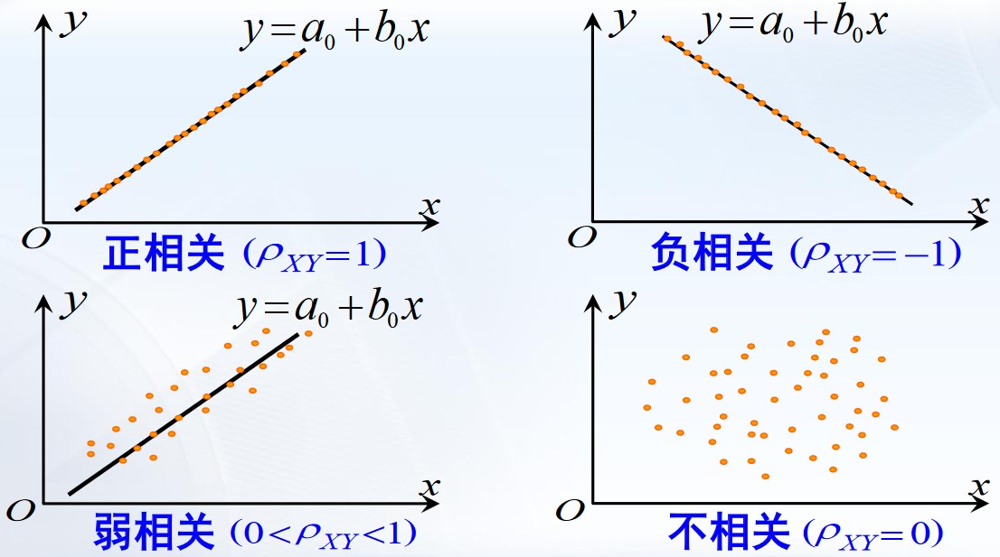
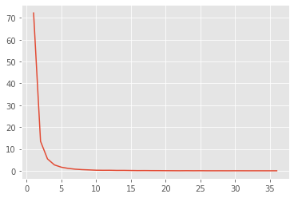
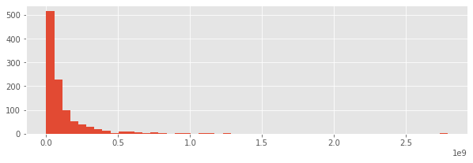
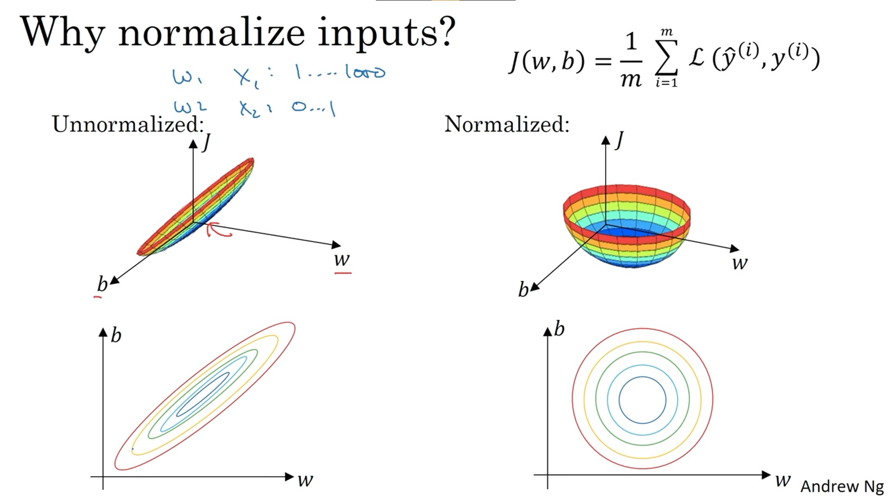

# 对电影票房的模型分析

## 摘要

电影票房是衡量电影成功程度的一个重要指标。提前预测电影的票房对电影产业链各个环节有巨大影响，对风险控制和决策具有重要的现实意义。
我将电影票房问题具体化，通过搜集相关数据，运用数学思想，建立数学模型来研究有关电影的以下问题：

1. 选取合理的指标，并依此对电影分类。
2. 对票房做出预测
3. 舆情分析，找水军
4. 考虑出席率对票房影响

对问题一，使用K-Mean与AP聚类算法，并用轮廓系数评估。结果轮廓系数可达0.19379(K-Mean)/0.13766(AP)。得到的中心点见附录。

对问题二，用余弦相似度表示相似程度,选出相似度最高的5部计算评分平均值。在测试数据上的误差为11.5%

## 关键词

电影票房 聚类分析 回归分析 K-Mean AP聚类 余弦相似度

## 问题重述

问题一：选取合适的分类特点，进行聚类分析，并作出评估

问题二：对票房做出预测，建立回归模型，用测试集做预测

## 问题分析

题中所给的数据，是非结构化的网站，即使使用爬虫，也有数据量小的问题，不易数据分析。在此改用TMDB(The Movie Database)数据集,包括了近五千部电影的详细信息。

借助Spearman相关系数，可以进行一定的降维。

对问题一，可以使用K-Mean算法和AP聚类进行聚类分析。
对问题二，筛选出这与之相似程度最高的5部影片，计算它们的平均票房，作为待预测影片的票房

舆论分析不会，出席率数据不足无法计算。

## 模型假设

假设参演电影平均票房可以代表一个演员、导演的水平。
假设票房的主要影响因素是影片类型、导演和主演。

## 符号说明

Spearman相关系数中:

|符号|意义|
|-|-|
|$\rho$|相关系数|
|n	|观测对象的数量	|
|$d_i$	|对应变量的秩之差，即两个变量分别排序后成对的变量位置（等级）差	|

AP聚类中：

|符号|意义|解释|
|-|-|-|
|S(i,j)|相似度|i给点k发送信息的适合程度|
|r(i,k)|吸引度|k给点i发送信息的适合程度|
|a(i,k)|吸引度|k给点i发送信息的适合程度|

## 问题一的求解

### Spearman相关系数

相关系数的定义为：

$$
\rho=\frac{\sum (x_i-\bar x)(y_i-\bar y)}{\sqrt{\sum (x_i-\bar x)^2\sum (y_i-\bar y)^2}}
$$

相关系数的值在+1和-1之间变化，值±1表示变量之间存在完美关联程度，即完全相关时绝对值为1；随着相关系数值趋于0，意味着变量之间的关系将减弱，完全不相关时为0。关系的方向由系数的符号表示；+号表示正向关系，-号表示负向关系。



|相关系数绝对值|相关程度|
|-|-|
|0.8-1.0|极强相关|
|0.6-0.8|强相关|
|0.4-0.6|中等程度相关|
|0.2-0.4|弱相关|
|0.0-0.2|极弱相关或无相关|


Spearman相关系数又称秩相关系数，是利用两变量的秩次大小作线性相关分析，对原始变量的分布不作要求，属于非参数统计方法，适用范围广。

斯皮尔曼等级相关是根据等级资料研究两个变量间相关关系的方法。它是依据两列成对等级的各对等级数之差来进行计算的，所以又称为“等级差数法”。

$$
\rho=1-\frac{6\sum d_i^2}{n(n^2-1)}
$$


画出相关系数的热力图，借此容易看出，热度(popularity)与投票人数(vote_count)极强相关。由于投票人数与其他的特征的相关度更大，我们舍去这一特征。

### 文本数据的数量化

演员、导演是判断影片种类、预测票房的重要因素，但原始数据是代表人名的文本，无法直接应用到算法中。因此需要将人名转化成数字。

#### 法1

按出现次序给每个人编号，以主演的编号表明演员，导演同理。但是两个编号的大小关系没有实际意义，不利于聚类分析，也不适合各种线性回归模型。

#### 法2

给每个人安排一个对应的分量，出现此人就记1，没出现就记0。但是，数据中共有30917个演员，这种方法会需要新增大量分量，第一是维度太大不好计算，第二是会喧宾夺主，使得影片成本、片场等因素对结果的影响微乎其微。

#### 法2的优化



*横轴表明演员参演的电影数量，纵轴表明人数占比(%)。*

在数据处理时发现，有高达72%的演员只参演了1部电影，如果精确到个人的话，这种数据训练的结果是没有泛化能力的。我们可以通过删去较少见的演员来减少维度。但即使只选择其中出演达到10次的演员，仍有500个维度。人数多的时候维度过多，人数少又会出现一批电影的演员均未被标注。

#### 法3

用出演电影数来代表一个演员。这样获得的数据，大小关系有意义。但是大量演员只演过一部电影，没有区分度。

#### 法4


*横轴表明参演的电影平均票房，纵轴表明人数。*
如果一个演员主演的电影平均票房高，说明可能是大牌演员，这是表征演员的一个很好指标。对导演也是同理。

这种方法没有前三个方法的弊端，所以选用这个。

### 归一化



不同数据的范围不同，如成本从10块的实验电影到耗资3.8亿美金的鸿篇巨制，而电影评分最高才10分。这会导致数据狭长。聚类算法用到了距离，狭长的样本空间会导致评分这样的数据失去作用；基于梯度下降的回归算法也不能正常工作(有鞍点)。因此需要将不同维度的数据变换到相同范围。常用的方法是伸压变换，把最大值都压缩到1，使得每个分量都是在[0,1]的范围。

最终得到数据格式是这样

> RangeIndex: 2065 entries, 0 to 2064
> Data columns (total 16 columns):
>
> #   Column                Non-Null Count  Dtype  
> ---  ------                --------------  -----
> 0   title                 2065 non-null   object 
> 1   genres                2065 non-null   object 
> 2   keywords              2065 non-null   object 
> 3   director              2065 non-null   object 
> 4   cast                  2065 non-null   object 
> 5   budget                2065 non-null   int64  
> 6   revenue               2065 non-null   int64  
> 7   popularity            2065 non-null   float64
> 8   vote_average          2065 non-null   float64
> 9   runtime               2065 non-null   float64
> 10  production_companies  2065 non-null   object 
> 11  year                  2065 non-null   int64  
> 12  month                 2065 non-null   float64
> 13  overview              2065 non-null   object 
> 14  cast_revenue          2065 non-null   float64
> 15  director_revenue      2065 non-null   float64
> dtypes: float64(6), int64(3), object(7)
> memory usage: 258.2+ KB

### 聚类

聚类是指把n个数据划分成k簇的无监督问题。

#### K-Means

1. 随机选择 K 个点作为初始质心
2. 计算每个样本到各个质心的距离，将样本划分到距离最近的质心所对应的簇中
3. 计算每个簇内所有样本的均值，并使用该均值更新簇的质心
4. 重复步骤2与3，直到质心的位置变化小于指定阈值

算法简单，O(n*k)的复杂度

取k=5，得到结果（取前20部为例）为:

> [5 0 5 0 0 0 5 0 0 0 5 0 0 0 0 0 0 0 5 0]

#### AP聚类

将全部数据点都当作潜在的聚类中心，然后数据点两两之间连线构成一个网络(相似度矩阵)，再通过网络中各条边的消息传递计算出各样本的聚类中心

步骤1: 将吸引度矩阵R和归属度矩阵初始化为0矩阵

步骤2: 更新吸引度矩阵

$$
r_{t+1}(i, k)=\{\begin{array}{l}{S(i, k)-\max _{j \neq k}\left\{a_{t}(i, j)+r_{t}(i, j)\right\}, i \neq k} \\ {S(i, k)-\max _{j \neq k}\{S(i, j)\}, i=k} \end{array}
$$

步骤3: 更新归属度矩阵

$$
a_{t+1}(i, k)=\{\begin{array}{l}{\min \left\{0, r_{t+1}(k, k)+\sum_{j \neq i, k} \max \left\{r_{t+1}(j, k), 0\right\}\right\}, i \neq k} \\ {\sum_{j \neq k} \max \left\{r_{t+1}(j, k), 0\right\}, i=k} \end{array}
$$

步骤4: 根据衰减系数λ对两个公式进行衰减

$$
\begin{aligned} &r_{t+1}(i, k)=\lambda * r_{t}(i, k)+(1-\lambda) * r_{t+1}(i, k)\\ &a_{t+1}(i, k)=\lambda * a_{t}(i, k)+(1-\lambda) * a_{t+1}(i, k) \end{aligned}
$$

步骤5: 重复步骤2，3,4直至矩阵稳定

步骤6: 取a+r最大的k作为聚类中心

一般使用负的欧式距离
AP聚类不需要指定k。鲁棒性强且准确度较高。
复杂度高，$O(N*N*\log N)$

结果（取前20部为例）为:

> [ 0  1  9  1  5  2  4  3 18  5 17  2  2  2  5  3  1  2  9  2]

### 聚类的评估

轮廓系数适用于实际类别信息未知的情况。对于单个样本，设a是与它同类别中其他样本的平均距离，b是与它距离最近不同类别中样本的平均距离，其轮廓系数为：

$$
s = \frac{b-a}{\max(a,b)}
$$

对于一个样本集合，它的轮廓系数是所有样本轮廓系数的平均值。轮廓系数的取值范围是[-1,1]，同类别样本距离越相近不同类别样本距离越远，分数越高。

对K-Mean，轮廓系数为0.19379

对AP聚类，轮廓系数为0.13766

## 问题二求解

相似程度用余弦相似度表示,值越大说明越不相似

对于给定的一部影片，计算它与其他所有影片的夹角，选出相似度最高的5部计算评分平均值

取不在数据集中的一部电影预测

> Justice_league = {'genres': ['Action', 'Adventure', 'Fantasy', 'Science Fiction'], 'director': ['Zack Snyder'], 'actors': ['Ben Affleck', 'Henry Cavill', 'Amy Adams', 'Gal Gadot', 'Ezra Miller']}

结果为374468753

实际数据是418000000，相差11.5%

## 参考文献

周志华 著. 机器学习, 北京: 清华大学出版社, 2016

汪文洁, 概率论与数理统计_国防科技大学_中国大学MOOC, https://www.icourse163.org/course/NUDT-438002?tid=1463128469

吴恩达, 深度学习, https://www.deeplearning.ai/ , 2021.12.20

圻子-, 数据特征分析：相关性分析-CSDN博客-pandas相关性分析, https://blog.csdn.net/weixin_44507435/article/details/105142544 , 2021.12.20

杰西伍卡, TMDb电影数据分析 & 电影评分预测 - 简书, https://www.jianshu.com/p/9d7d56dadcc6 , 2021.12.20

钱魏Way, 聚类算法之Affinity Propagation, https://www.biaodianfu.com/affinity-propagationap.html#AP%E4%B8%8EKMeans%E5%AF%B9%E6%AF%94, 2021.12.20

钱魏Way, 聚类算法评估指标, https://www.biaodianfu.com/cluster-score.html, 2021.12.20

## 附录


K-Mean的中心点

>   array([[0.62368421, 1.        , 0.17181451, 0.86746988, 0.80597015,
>           0.99702233, 1.        , 0.58388149, 1.        ],
>          [0.78947368, 0.34469585, 0.15884603, 0.8313253 , 0.84079602,
>           0.99602978, 0.41666667, 0.43819497, 0.16279223],
>          [0.56578947, 0.26980821, 0.10263613, 0.78313253, 0.67661692,
>           0.99851117, 0.5       , 0.43746689, 0.18157282],
>          [0.52631579, 0.43595955, 0.08872058, 0.81927711, 0.64676617,
>           0.99900744, 0.33333333, 0.5507273 , 0.22081072],
>          [0.52631579, 0.11665636, 0.04539183, 0.79518072, 0.47761194,
>           0.99702233, 0.91666667, 0.71758717, 0.08377315],
>          [0.44736842, 0.14225429, 0.08814598, 0.69879518, 0.6318408 ,
>           0.99851117, 0.41666667, 0.29961542, 0.14225429],
>          [0.47368421, 0.2720765 , 0.12633966, 0.84337349, 0.48258706,
>           0.99950372, 0.41666667, 0.38024574, 0.2720765 ],
>          [0.44736842, 0.27738103, 0.54946196, 0.95180723, 0.60199005,
>           0.99950372, 0.58333333, 0.37352914, 0.13874865],
>          [0.43421053, 0.24215512, 0.82716223, 0.97590361, 0.84079602,
>           0.99950372, 0.91666667, 0.1846739 , 0.18954161],
>          [0.42105263, 0.23437462, 0.14537134, 0.79518072, 0.68159204,
>           1.        , 0.91666667, 0.51770939, 0.21180015],
>                 [0.39473684, 0.07721895, 0.04063679, 0.69879518, 0.54228856,
>                   0.99751861, 0.58333333, 0.16820598, 0.06876324],
>                 [0.39473684, 0.32135303, 0.11563794, 0.90361446, 0.78109453,
>                   0.99503722, 0.91666667, 0.82814082, 0.14774017],
>                 [0.39473684, 0.45704267, 0.18858941, 0.87951807, 0.50746269,
>                   0.99900744, 0.91666667, 0.2229451 , 0.45704267],
>                 [0.39473684, 0.2649243 , 0.08084447, 0.80722892, 0.68656716,
>                   0.99404467, 0.41666667, 0.30409506, 0.12926286],
>                 [0.36842105, 0.15494136, 0.06185535, 0.69879518, 0.66169154,
>                   0.99354839, 0.91666667, 0.19576974, 0.05505376],
>                 [0.36842105, 0.13291765, 0.08509346, 0.79518072, 0.61691542,
>                   0.99801489, 0.58333333, 0.49131837, 0.10132289],
>                 [0.34210526, 0.22659701, 0.09672391, 0.8313253 , 0.44776119,
>                   0.99652605, 0.5       , 0.29353757, 0.13079716],
>                 [0.34210526, 0.13340916, 0.10271838, 0.80722892, 0.53233831,
>                   0.99801489, 0.83333333, 0.29225045, 0.11950267],
>                 [0.34210526, 0.28329069, 0.09100194, 0.92771084, 0.70149254,
>                   0.99454094, 0.41666667, 0.82814082, 0.14435024],
>                 [0.31578947, 0.09296235, 0.03839291, 0.62650602, 0.52736318,
>                   0.99404467, 0.5       , 0.38354262, 0.0686135 ],
>                 [0.31578947, 0.10264425, 0.07731778, 0.77108434, 0.61691542,
>                   0.99900744, 0.33333333, 0.48829123, 0.12307029],
>                 [0.28947368, 0.12108475, 0.08167214, 0.73493976, 0.50746269,
>                   0.99950372, 0.25      , 0.31931055, 0.12108475],
>                 [0.20789474, 0.33224498, 0.12210742, 0.96385542, 0.89054726,
>                   0.99354839, 1.        , 0.56589559, 0.29123364],
>                 [0.26315789, 0.05576266, 0.0180859 , 0.75903614, 0.64676617,
>                   0.99255583, 0.58333333, 0.222495  , 0.08377315],
>                 [0.24210526, 0.09473058, 0.04591687, 0.6746988 , 0.48756219,
>                   0.99255583, 0.91666667, 0.38354262, 0.0686135 ],
>                 [0.23684211, 0.08343628, 0.05442223, 0.86746988, 0.78606965,
>                   0.99801489, 1.        , 0.4109735 , 0.08620287],
>                 [0.22368421, 0.02811457, 0.02150315, 0.6626506 , 0.53731343,
>                   0.99354839, 0.16666667, 0.27655519, 0.02811457],
>                 [0.21052632, 0.08858944, 0.05206777, 0.69879518, 0.49751244,
>                   0.99900744, 0.58333333, 0.25826521, 0.06599524],
>                 [0.20526316, 0.08909173, 0.04710859, 0.77108434, 0.47263682,
>                   0.99900744, 0.75      , 0.37917633, 0.08909173],
>                 [0.19736842, 0.03520846, 0.02627352, 0.68674699, 0.49751244,
>                   0.99751861, 0.5       , 0.18204913, 0.04105663],
>                 [0.19473684, 0.41490152, 1.        , 0.77108434, 0.45273632,
>                   1.        , 0.5       , 0.32897269, 0.41490152],
>                        [0.39473684, 0.32993195, 0.05404501, 0.80722892, 0.46268657,
>                           0.99454094, 0.41666667, 0.74451566, 0.2306975 ],
>                        [0.17368421, 0.07291255, 0.062604  , 0.73493976, 0.64676617,
>                           0.99950372, 0.25      , 0.27466972, 0.07291255],
>                        [0.15526316, 0.13746841, 0.11370957, 0.85542169, 0.40298507,
>                           0.99354839, 0.25      , 0.69316458, 0.10908563],
>                        [0.15789474, 0.03627522, 0.03412191, 0.77108434, 0.61691542,
>                           1.        , 1.        , 0.51770939, 0.05843524],
>                               [0.15789474, 0.02624659, 0.02099197, 0.71084337, 0.50248756,
>                                   0.99652605, 0.75      , 0.17408866, 0.01615972],
>                               [0.15789474, 0.0181674 , 0.02133016, 0.60240964, 0.44776119,
>                                   0.99652605, 0.58333333, 0.41447163, 0.01560547],
>                               [0.15263158, 0.03058871, 0.01645044, 0.61445783, 0.51243781,
>                                   0.99702233, 1.        , 0.18158196, 0.03880149],
>                               [0.18421053, 0.08105947, 0.05008027, 0.77108434, 0.51741294,
>                                   0.99652605, 1.        , 0.2450957 , 0.09332547],
>                               [0.11842105, 0.06613291, 0.05164613, 0.87951807, 0.64179104,
>                                   0.9955335 , 0.25      , 0.19507958, 0.02472065],
>                               [0.13157895, 0.02157896, 0.01529479, 0.72289157, 0.58706468,
>                                   0.99702233, 0.16666667, 0.12676157, 0.0385974 ],
>                               [0.12631579, 0.07443268, 0.02874686, 0.8313253 , 0.73134328,
>                                   0.99255583, 1.        , 0.19731468, 0.06623988],
>                               [0.10526316, 0.04010504, 0.04145954, 0.71084337, 0.49751244,
>                                   1.        , 0.25      , 0.18747013, 0.04010504],
>                                      [0.07894737, 0.04691106, 0.04413515, 0.78313253, 0.56218905,
>                                           0.99801489, 0.16666667, 0.37023897, 0.03841655],
>                                      [0.10526316, 0.02186751, 0.0385869 , 0.78313253, 0.53731343,
>                                           0.99801489, 0.58333333, 0.47490483, 0.09121092],
>                                      [0.09473684, 0.01590799, 0.02267629, 0.69879518, 0.54228856,
>                                           0.99404467, 0.33333333, 0.38185088, 0.04619663],
>                                      [0.09210526, 0.040368  , 0.03649912, 0.87951807, 0.62189055,
>                                           0.99900744, 0.91666667, 0.4203739 , 0.04691324],
>                                      [0.09210526, 0.03063772, 0.02958405, 0.62650602, 0.49751244,
>                                           0.99652605, 0.83333333, 0.2862057 , 0.04508965],
>                                      [0.08421053, 0.04520907, 0.04364767, 0.75903614, 0.53233831,
>                                           0.99900744, 0.5       , 0.30526619, 0.02481809],
>                                      [0.07894737, 0.02782202, 0.02649372, 0.75903614, 0.50248756,
>                                           0.99602978, 0.16666667, 0.2450957 , 0.0285226 ],
>                                      [0.07894737, 0.03013876, 0.06329969, 0.86746988, 0.60199005,
>                                           1.        , 0.75      , 0.18488649, 0.02549725],
>                                             [0.07894737, 0.03036151, 0.01211652, 0.44578313, 0.41791045,
>                                                   0.99652605, 0.08333333, 0.12208577, 0.02257689],
>                                             [0.07894737, 0.02287765, 0.0356243 , 0.78313253, 0.55223881,
>                                                   0.99801489, 0.33333333, 0.12346588, 0.03402514],
>                                             [0.06578947, 0.0108016 , 0.01382207, 0.56626506, 0.50746269,
>                                                   0.99454094, 0.33333333, 0.10603552, 0.0108016 ],
>                                             [0.07368421, 0.03450147, 0.05145717, 0.85542169, 0.58208955,
>                                                   0.99751861, 0.25      , 0.45809092, 0.05355369],
>                                             [0.07368421, 0.0434539 , 0.04178233, 0.92771084, 0.67164179,
>                                                   0.99503722, 0.75      , 0.35112844, 0.03402514],
>                                             [0.07368421, 0.02471223, 0.02914747, 0.68674699, 0.44776119,
>                                                   0.99950372, 0.33333333, 0.31378268, 0.02538168],
>                                             [0.07236842, 0.00887697, 0.01455156, 0.74698795, 0.59701493,
>                                                   0.99602978, 0.75      , 0.51757181, 0.04781522],
>                                             [0.06842105, 0.02436137, 0.03538404, 0.62650602, 0.49751244,
>                                                   0.99751861, 0.08333333, 0.52393675, 0.02622482],
>                                             [0.06842105, 0.01553762, 0.0252134 , 0.81927711, 0.51741294,
>                                                   0.99702233, 0.08333333, 0.48269028, 0.01533534],
>                                             [0.06578947, 0.02903058, 0.01455001, 0.6746988 , 0.41293532,
>                                                   0.99305211, 1.        , 0.78744365, 0.0244116 ],
>                                             [0.06578947, 0.02526679, 0.02950962, 0.6746988 , 0.48258706,
>                                                   0.99652605, 0.66666667, 0.22784764, 0.02526679],
>                                             [0.06578947, 0.02371695, 0.03373009, 0.85542169, 0.56716418,
>                                                   0.99602978, 0.91666667, 0.2322422 , 0.02371695],
>                                             [0.06578947, 0.00711809, 0.0201053 , 0.77108434, 0.60199005,
>                                                   0.99652605, 0.41666667, 0.20598527, 0.01589611],
>                                             [0.06578947, 0.03396011, 0.04016735, 0.78313253, 0.51741294,
>                                                   0.99602978, 0.58333333, 0.17190572, 0.03327888],
>                                             [0.05526316, 0.00939505, 0.01588272, 0.86746988, 0.72139303,
>                                                   0.9955335 , 0.75      , 0.09138168, 0.03881084],
>                                             [0.06578947, 0.03335473, 0.0216557 , 0.78313253, 0.5920398 ,
>                                                   0.99602978, 0.75      , 0.24945275, 0.05135942],
>                                             [0.05526316, 0.01476732, 0.0202688 , 0.90361446, 0.6119403 ,
>                                                   0.99602978, 0.08333333, 0.13782941, 0.03085384],
>                                             [0.05263158, 0.04204653, 0.02397463, 0.77108434, 0.46766169,
>                                                   0.99751861, 0.83333333, 0.18559483, 0.03641696],
>                                             [0.05263158, 0.01694496, 0.03026221, 0.63855422, 0.45771144,
>                                                   0.99900744, 0.08333333, 0.24352385, 0.02085708],
>                                             [0.05263158, 0.01348563, 0.01805065, 0.62650602, 0.48258706,
>                                                   0.9955335 , 0.75      , 0.05114566, 0.0138385 ],
>                                             [0.07894737, 0.00992628, 0.00586324, 0.77108434, 0.50248756,
>                                                   0.99354839, 0.91666667, 0.47353791, 0.04638791],
>                                             [0.03947368, 0.00985021, 0.03098887, 0.74698795, 0.49253731,
>                                                   0.99801489, 0.75      , 0.35112844, 0.01713499],
>                                             [0.04736842, 0.00800197, 0.01589411, 0.80722892, 0.57711443,
>                                                   0.99900744, 1.        , 0.14415321, 0.00800197],
>                                             [0.04473684, 0.02048228, 0.02683013, 0.77108434, 0.54228856,
>                                                   0.9955335 , 1.        , 0.24108721, 0.01757745],
>                                             [0.03947368, 0.0478603 , 0.03419821, 0.87951807, 0.49751244,
>                                                   0.99801489, 0.41666667, 0.26284003, 0.0478603 ],
>                                             [0.04210526, 0.01452413, 0.01348506, 0.63855422, 0.45273632,
>                                                   0.99801489, 0.16666667, 0.14962798, 0.01452413],
>                                             [0.04473684, 0.01991935, 0.01362257, 0.68674699, 0.46766169,
>                                                   0.99404467, 0.33333333, 0.10713287, 0.01991935],
>                                             [0.03947368, 0.02207657, 0.03605047, 0.71084337, 0.48756219,
>                                                   1.        , 0.91666667, 0.11225608, 0.02207657],
>                                                    [0.03421053, 0.0135098 , 0.01261515, 0.54216867, 0.46766169,
>                                                           0.99354839, 0.58333333, 0.10303487, 0.0135098 ],
>                                                    [0.03947368, 0.00533275, 0.01245698, 0.72289157, 0.51243781,
>                                                           0.99454094, 0.66666667, 0.10713287, 0.01111142],
>                                                    [0.03947368, 0.00339145, 0.03538609, 0.81927711, 0.51741294,
>                                                           0.99751861, 0.75      , 0.14835386, 0.01106157],
>                                                    [0.03368421, 0.01435882, 0.02515155, 0.91566265, 0.69651741,
>                                                           0.99255583, 0.41666667, 0.05773781, 0.00747548],
>                                                    [0.02236842, 0.01561305, 0.04601182, 0.81927711, 0.49751244,
>                                                           1.        , 0.16666667, 0.09384773, 0.01561305],
>                                                           [0.01315789, 0.00964445, 0.02064681, 0.8313253 , 0.48258706,
>                                                                   0.9955335 , 0.41666667, 0.04375676, 0.01011466],
>                                                           [0.01315789, 0.0014493 , 0.00705181, 0.79518072, 0.54726368,
>                                                                   0.99652605, 0.66666667, 0.8459192 , 0.0014493 ],
>                                                           [0.01315789, 0.0064107 , 0.00623756, 0.85542169, 0.49253731,
>                                                                   0.99702233, 0.75      , 0.02577786, 0.0064107 ]])

AP的中心点

> array([[0.62368421, 1.        , 0.17181451, 0.86746988, 0.80597015,
        0.99702233, 1.        , 0.58388149, 1.        ],
       [0.78947368, 0.34469585, 0.15884603, 0.8313253 , 0.84079602,
        0.99602978, 0.41666667, 0.43819497, 0.16279223],
       [0.56578947, 0.26980821, 0.10263613, 0.78313253, 0.67661692,
        0.99851117, 0.5       , 0.43746689, 0.18157282],
       [0.52631579, 0.43595955, 0.08872058, 0.81927711, 0.64676617,
        0.99900744, 0.33333333, 0.5507273 , 0.22081072],
       [0.52631579, 0.11665636, 0.04539183, 0.79518072, 0.47761194,
        0.99702233, 0.91666667, 0.71758717, 0.08377315],
       [0.44736842, 0.14225429, 0.08814598, 0.69879518, 0.6318408 ,
        0.99851117, 0.41666667, 0.29961542, 0.14225429],
       [0.47368421, 0.2720765 , 0.12633966, 0.84337349, 0.48258706,
        0.99950372, 0.41666667, 0.38024574, 0.2720765 ],
       [0.44736842, 0.27738103, 0.54946196, 0.95180723, 0.60199005,
        0.99950372, 0.58333333, 0.37352914, 0.13874865],
       [0.43421053, 0.24215512, 0.82716223, 0.97590361, 0.84079602,
        0.99950372, 0.91666667, 0.1846739 , 0.18954161],
       [0.42105263, 0.23437462, 0.14537134, 0.79518072, 0.68159204,
        1.        , 0.91666667, 0.51770939, 0.21180015],
       [0.39473684, 0.07721895, 0.04063679, 0.69879518, 0.54228856,
        0.99751861, 0.58333333, 0.16820598, 0.06876324],
       [0.39473684, 0.32135303, 0.11563794, 0.90361446, 0.78109453,
        0.99503722, 0.91666667, 0.82814082, 0.14774017],
       [0.39473684, 0.45704267, 0.18858941, 0.87951807, 0.50746269,
        0.99900744, 0.91666667, 0.2229451 , 0.45704267],
       [0.39473684, 0.2649243 , 0.08084447, 0.80722892, 0.68656716,
        0.99404467, 0.41666667, 0.30409506, 0.12926286],
       [0.36842105, 0.15494136, 0.06185535, 0.69879518, 0.66169154,
        0.99354839, 0.91666667, 0.19576974, 0.05505376],
       [0.36842105, 0.13291765, 0.08509346, 0.79518072, 0.61691542,
        0.99801489, 0.58333333, 0.49131837, 0.10132289],
       [0.34210526, 0.22659701, 0.09672391, 0.8313253 , 0.44776119,
        0.99652605, 0.5       , 0.29353757, 0.13079716],
       [0.34210526, 0.13340916, 0.10271838, 0.80722892, 0.53233831,
        0.99801489, 0.83333333, 0.29225045, 0.11950267],
       [0.34210526, 0.28329069, 0.09100194, 0.92771084, 0.70149254,
        0.99454094, 0.41666667, 0.82814082, 0.14435024],
       [0.31578947, 0.09296235, 0.03839291, 0.62650602, 0.52736318,
        0.99404467, 0.5       , 0.38354262, 0.0686135 ],
       [0.31578947, 0.10264425, 0.07731778, 0.77108434, 0.61691542,
        0.99900744, 0.33333333, 0.48829123, 0.12307029],
       [0.28947368, 0.12108475, 0.08167214, 0.73493976, 0.50746269,
        0.99950372, 0.25      , 0.31931055, 0.12108475],
       [0.20789474, 0.33224498, 0.12210742, 0.96385542, 0.89054726,
        0.99354839, 1.        , 0.56589559, 0.29123364],
       [0.26315789, 0.05576266, 0.0180859 , 0.75903614, 0.64676617,
        0.99255583, 0.58333333, 0.222495  , 0.08377315],
       [0.24210526, 0.09473058, 0.04591687, 0.6746988 , 0.48756219,
        0.99255583, 0.91666667, 0.38354262, 0.0686135 ],
       [0.23684211, 0.08343628, 0.05442223, 0.86746988, 0.78606965,
        0.99801489, 1.        , 0.4109735 , 0.08620287],
       [0.22368421, 0.02811457, 0.02150315, 0.6626506 , 0.53731343,
        0.99354839, 0.16666667, 0.27655519, 0.02811457],
       [0.21052632, 0.08858944, 0.05206777, 0.69879518, 0.49751244,
        0.99900744, 0.58333333, 0.25826521, 0.06599524],
       [0.20526316, 0.08909173, 0.04710859, 0.77108434, 0.47263682,
        0.99900744, 0.75      , 0.37917633, 0.08909173],
       [0.19736842, 0.03520846, 0.02627352, 0.68674699, 0.49751244,
        0.99751861, 0.5       , 0.18204913, 0.04105663],
       [0.19473684, 0.41490152, 1.        , 0.77108434, 0.45273632,
        1.        , 0.5       , 0.32897269, 0.41490152],
       [0.39473684, 0.32993195, 0.05404501, 0.80722892, 0.46268657,
        0.99454094, 0.41666667, 0.74451566, 0.2306975 ],
       [0.17368421, 0.07291255, 0.062604  , 0.73493976, 0.64676617,
        0.99950372, 0.25      , 0.27466972, 0.07291255],
       [0.15526316, 0.13746841, 0.11370957, 0.85542169, 0.40298507,
        0.99354839, 0.25      , 0.69316458, 0.10908563],
       [0.15789474, 0.03627522, 0.03412191, 0.77108434, 0.61691542,
        1.        , 1.        , 0.51770939, 0.05843524],
       [0.15789474, 0.02624659, 0.02099197, 0.71084337, 0.50248756,
        0.99652605, 0.75      , 0.17408866, 0.01615972],
       [0.15789474, 0.0181674 , 0.02133016, 0.60240964, 0.44776119,
        0.99652605, 0.58333333, 0.41447163, 0.01560547],
       [0.15263158, 0.03058871, 0.01645044, 0.61445783, 0.51243781,
        0.99702233, 1.        , 0.18158196, 0.03880149],
       [0.18421053, 0.08105947, 0.05008027, 0.77108434, 0.51741294,
        0.99652605, 1.        , 0.2450957 , 0.09332547],
       [0.11842105, 0.06613291, 0.05164613, 0.87951807, 0.64179104,
        0.9955335 , 0.25      , 0.19507958, 0.02472065],
       [0.13157895, 0.02157896, 0.01529479, 0.72289157, 0.58706468,
        0.99702233, 0.16666667, 0.12676157, 0.0385974 ],
       [0.12631579, 0.07443268, 0.02874686, 0.8313253 , 0.73134328,
        0.99255583, 1.        , 0.19731468, 0.06623988],
       [0.10526316, 0.04010504, 0.04145954, 0.71084337, 0.49751244,
        1.        , 0.25      , 0.18747013, 0.04010504],
       [0.07894737, 0.04691106, 0.04413515, 0.78313253, 0.56218905,
        0.99801489, 0.16666667, 0.37023897, 0.03841655],
       [0.10526316, 0.02186751, 0.0385869 , 0.78313253, 0.53731343,
        0.99801489, 0.58333333, 0.47490483, 0.09121092],
       [0.09473684, 0.01590799, 0.02267629, 0.69879518, 0.54228856,
        0.99404467, 0.33333333, 0.38185088, 0.04619663],
       [0.09210526, 0.040368  , 0.03649912, 0.87951807, 0.62189055,
        0.99900744, 0.91666667, 0.4203739 , 0.04691324],
       [0.09210526, 0.03063772, 0.02958405, 0.62650602, 0.49751244,
        0.99652605, 0.83333333, 0.2862057 , 0.04508965],
       [0.08421053, 0.04520907, 0.04364767, 0.75903614, 0.53233831,
        0.99900744, 0.5       , 0.30526619, 0.02481809],
       [0.07894737, 0.02782202, 0.02649372, 0.75903614, 0.50248756,
        0.99602978, 0.16666667, 0.2450957 , 0.0285226 ],
       [0.07894737, 0.03013876, 0.06329969, 0.86746988, 0.60199005,
        1.        , 0.75      , 0.18488649, 0.02549725],
       [0.07894737, 0.03036151, 0.01211652, 0.44578313, 0.41791045,
        0.99652605, 0.08333333, 0.12208577, 0.02257689],
       [0.07894737, 0.02287765, 0.0356243 , 0.78313253, 0.55223881,
        0.99801489, 0.33333333, 0.12346588, 0.03402514],
       [0.06578947, 0.0108016 , 0.01382207, 0.56626506, 0.50746269,
        0.99454094, 0.33333333, 0.10603552, 0.0108016 ],
       [0.07368421, 0.03450147, 0.05145717, 0.85542169, 0.58208955,
        0.99751861, 0.25      , 0.45809092, 0.05355369],
       [0.07368421, 0.0434539 , 0.04178233, 0.92771084, 0.67164179,
        0.99503722, 0.75      , 0.35112844, 0.03402514],
       [0.07368421, 0.02471223, 0.02914747, 0.68674699, 0.44776119,
        0.99950372, 0.33333333, 0.31378268, 0.02538168],
       [0.07236842, 0.00887697, 0.01455156, 0.74698795, 0.59701493,
        0.99602978, 0.75      , 0.51757181, 0.04781522],
       [0.06842105, 0.02436137, 0.03538404, 0.62650602, 0.49751244,
        0.99751861, 0.08333333, 0.52393675, 0.02622482],
       [0.06842105, 0.01553762, 0.0252134 , 0.81927711, 0.51741294,
        0.99702233, 0.08333333, 0.48269028, 0.01533534],
       [0.06578947, 0.02903058, 0.01455001, 0.6746988 , 0.41293532,
        0.99305211, 1.        , 0.78744365, 0.0244116 ],
       [0.06578947, 0.02526679, 0.02950962, 0.6746988 , 0.48258706,
        0.99652605, 0.66666667, 0.22784764, 0.02526679],
       [0.06578947, 0.02371695, 0.03373009, 0.85542169, 0.56716418,
        0.99602978, 0.91666667, 0.2322422 , 0.02371695],
       [0.06578947, 0.00711809, 0.0201053 , 0.77108434, 0.60199005,
        0.99652605, 0.41666667, 0.20598527, 0.01589611],
       [0.06578947, 0.03396011, 0.04016735, 0.78313253, 0.51741294,
        0.99602978, 0.58333333, 0.17190572, 0.03327888],
       [0.05526316, 0.00939505, 0.01588272, 0.86746988, 0.72139303,
        0.9955335 , 0.75      , 0.09138168, 0.03881084],
       [0.06578947, 0.03335473, 0.0216557 , 0.78313253, 0.5920398 ,
        0.99602978, 0.75      , 0.24945275, 0.05135942],
       [0.05526316, 0.01476732, 0.0202688 , 0.90361446, 0.6119403 ,
        0.99602978, 0.08333333, 0.13782941, 0.03085384],
       [0.05263158, 0.04204653, 0.02397463, 0.77108434, 0.46766169,
        0.99751861, 0.83333333, 0.18559483, 0.03641696],
       [0.05263158, 0.01694496, 0.03026221, 0.63855422, 0.45771144,
        0.99900744, 0.08333333, 0.24352385, 0.02085708],
       [0.05263158, 0.01348563, 0.01805065, 0.62650602, 0.48258706,
        0.9955335 , 0.75      , 0.05114566, 0.0138385 ],
       [0.07894737, 0.00992628, 0.00586324, 0.77108434, 0.50248756,
        0.99354839, 0.91666667, 0.47353791, 0.04638791],
       [0.03947368, 0.00985021, 0.03098887, 0.74698795, 0.49253731,
        0.99801489, 0.75      , 0.35112844, 0.01713499],
       [0.04736842, 0.00800197, 0.01589411, 0.80722892, 0.57711443,
        0.99900744, 1.        , 0.14415321, 0.00800197],
       [0.04473684, 0.02048228, 0.02683013, 0.77108434, 0.54228856,
        0.9955335 , 1.        , 0.24108721, 0.01757745],
       [0.03947368, 0.0478603 , 0.03419821, 0.87951807, 0.49751244,
        0.99801489, 0.41666667, 0.26284003, 0.0478603 ],
       [0.04210526, 0.01452413, 0.01348506, 0.63855422, 0.45273632,
        0.99801489, 0.16666667, 0.14962798, 0.01452413],
       [0.04473684, 0.01991935, 0.01362257, 0.68674699, 0.46766169,
        0.99404467, 0.33333333, 0.10713287, 0.01991935],
       [0.03947368, 0.02207657, 0.03605047, 0.71084337, 0.48756219,
        1.        , 0.91666667, 0.11225608, 0.02207657],
       [0.03421053, 0.0135098 , 0.01261515, 0.54216867, 0.46766169,
        0.99354839, 0.58333333, 0.10303487, 0.0135098 ],
       [0.03947368, 0.00533275, 0.01245698, 0.72289157, 0.51243781,
        0.99454094, 0.66666667, 0.10713287, 0.01111142],
       [0.03947368, 0.00339145, 0.03538609, 0.81927711, 0.51741294,
        0.99751861, 0.75      , 0.14835386, 0.01106157],
       [0.03368421, 0.01435882, 0.02515155, 0.91566265, 0.69651741,
        0.99255583, 0.41666667, 0.05773781, 0.00747548],
       [0.02236842, 0.01561305, 0.04601182, 0.81927711, 0.49751244,
        1.        , 0.16666667, 0.09384773, 0.01561305],
       [0.01315789, 0.00964445, 0.02064681, 0.8313253 , 0.48258706,
        0.9955335 , 0.41666667, 0.04375676, 0.01011466],
       [0.01315789, 0.0014493 , 0.00705181, 0.79518072, 0.54726368,
        0.99652605, 0.66666667, 0.8459192 , 0.0014493 ],
       [0.01315789, 0.0064107 , 0.00623756, 0.85542169, 0.49253731,
        0.99702233, 0.75      , 0.02577786, 0.0064107 ]])

### 代码

``` python

# %%
import pandas as pd
import numpy as np
import matplotlib.pyplot as plt
import seaborn as sns
plt.style.use('ggplot')
%matplotlib inline
movies = pd.read_csv('tmdb_5000_movies.csv')
credits = pd.read_csv('tmdb_5000_credits.csv')

# %%
movies.head(2)

# %%
movies.info()

# %%
credits.head(2)

# %%
credits.info()

# %%
movies_credits = movies.merge(credits, left_on='id', right_on='movie_id', how='left')
del movies,credits

# %%
movies_credits.info()

# %%
movies_credits.head(2)

# %%
movies_credits.genres[0]

# %%
import json
json_columns = ['genres', 'keywords', 'production_companies', 'production_countries', 'cast', 'crew']
def extractName(column):
    col = [[di['name'] for di in row] for row in column]
    return col
for column in json_columns:
    movies_credits[column] = movies_credits[column].apply(json.loads)
for column in json_columns[:-1]:
    movies_credits[column] = extractName(movies_credits[column])
movies_credits.genres[0]

# %%
def findDirector(crew, job):
    name = ''
    for di in crew:
        if di['job'] == job:
            name = di['name']
            break
    return name
movies_credits['director'] = [findDirector(crew, 'Director') for crew in movies_credits.crew]

# %%
movies_credits['year'] = pd.to_datetime(movies_credits['release_date']).apply(lambda x: x.year)
movies_credits['month'] = pd.to_datetime(movies_credits['release_date']).apply(lambda x: x.month)

# %%
movies = movies_credits[[
    'title_x', 'genres', 'keywords', 'director', 'cast', 'budget', 'revenue',
    'popularity', 'vote_average', 'vote_count', 'runtime',
    'production_companies', 'year', 'month', 'overview'
]].dropna()
del movies_credits
movies.rename(columns={'title_x': 'title'}, inplace=True)
movies.year = movies.year.astype(int)

# %%
movies.head(2)

# %%
movies.groupby('year').size().plot(kind='bar')
movies.describe()

# %%
data = movies[(movies.year >= 2000) & (movies.year < 2016) &
              (movies.vote_count > 50) & (movies.budget * movies.revenue > 0)]
data.groupby('year').size().plot(kind='bar')
data.describe()

# %%
plt.figure(figsize=(16, 9))
ax = sns.heatmap(data.corr(method='spearman'),
                 cmap='Reds',
                 annot=True,
                 linewidths=0.05)
ax.set_xticklabels(ax.get_xticklabels(), rotation=45)
ax.set_yticklabels(ax.get_yticklabels(), rotation=45)
plt.show()

# %%
data = data.drop('vote_count', axis=1)
data.info()

# %%
cast_revenue = pd.concat([
    pd.concat([pd.DataFrame({
        'cast': [j],
        'revenue': [data['revenue'][i]]
    }) for j in data['cast'][i]]) for i in data.index
],ignore_index=True)
revenue_of_cast = cast_revenue.groupby('cast').revenue.mean()
revenue_of_cast.hist(bins=50, figsize=(10, 3))
revenue_of_cast

# %%
revenue_of_director = data.groupby('director').revenue.mean()
revenue_of_director.hist(bins=50, figsize=(10, 3))
revenue_of_director

# %%
# casts = {}
# for i in data['cast']:
#     for j in i:
#         if j in casts:
#             casts[j] += 1
#         else:
#             casts[j] = 1
# casts = {
#     k: v
#     for k, v in sorted(casts.items(), key=lambda x: x[1], reverse=True)
# }
# casts

# %%
# c = [0 for x in range(37)]
# for i in casts.values():
#     c[i] += 1
# c = c[1:]
# all_casts = sum(c)
# print(all_casts)
# print(c)
# f = lambda x: 100 * x / all_casts
# s = [sum(c[x:]) for x in range(36)]
# plt.plot(range(1, 37), [f(x) for x in s])
# plt.show()
# print(s)

# %%
# data['cast_count'] = [casts[x[0]] for x in data['cast']]
data['cast_revenue'] = [revenue_of_cast[x[0]] for x in data['cast']]
data['cast_revenue'].head(5)

# %%
# directors = {}
# for i in data['director']:
#     if i in directors:
#         directors[i] += 1
#     else:
#         directors[i] = 1
# directors = {
#     k: v
#     for k, v in sorted(directors.items(), key=lambda x: x[1], reverse=True)
# }
# n = 1
# for x in directors:
#     directors[x] = n
#     n += 1
# data['director_id'] = [directors[x] for x in data['director']]
data['director_revenue'] = [revenue_of_director[x] for x in data['director']]
data['director_revenue'].head(5)

# %%
data.describe()

# %%
data.to_csv('data.csv',index=False)

# %%
num_data = data[[
    'budget', 'revenue', 'popularity', 'vote_average', 'runtime', 'year',
    'month', 'cast_revenue', 'director_revenue'
]]
for x in num_data:
    num_data[x]/=num_data[x].max()
num_data.to_csv('num_data.csv', index=False)

# %%
import numpy as np
import pandas as pd
import matplotlib.pyplot as plt
import seaborn as sns
from sklearn.cluster import KMeans,AffinityPropagation
from sklearn import metrics
plt.style.use('ggplot')
%matplotlib inline
data=pd.read_csv('data.csv')
num_data =pd.read_csv('num_data.csv')

# %%
model=KMeans(n_clusters=8).fit(num_data)
prediction = model.predict(num_data)
centers = model.cluster_centers_
print(prediction[:20])

# %%
centers

# %%
model = AffinityPropagation().fit(num_data)
prediction = model.predict(num_data)
centers = model.cluster_centers_
model.cluster_centers_indices_
print(prediction[:20])

# %%
labels = model.labels_
metrics.silhouette_score(num_data, labels, metric='euclidean')