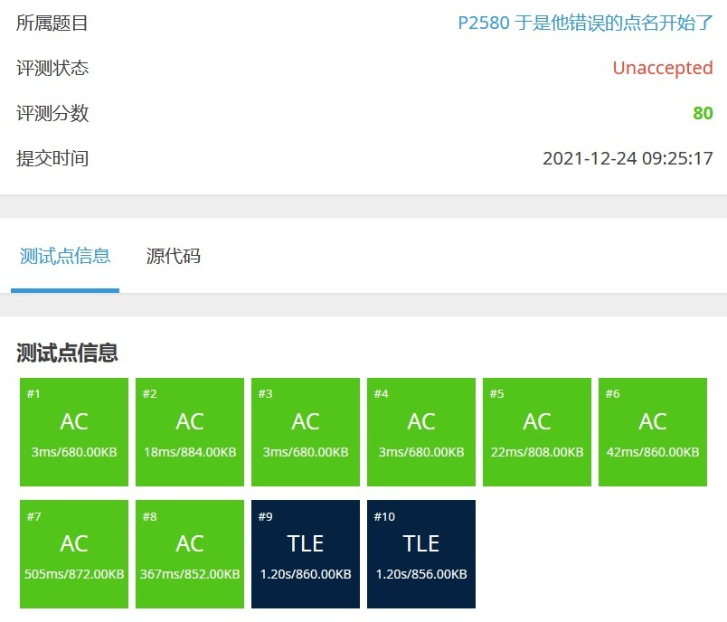
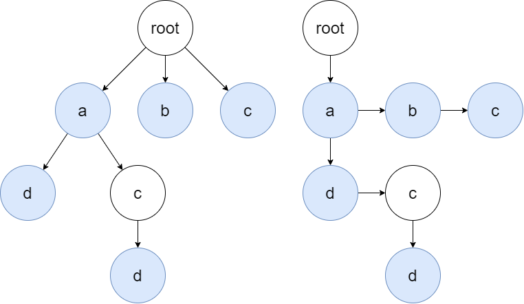
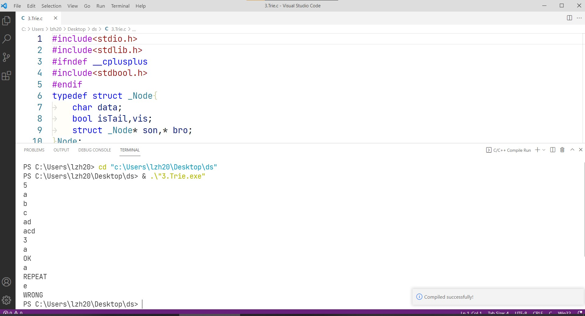
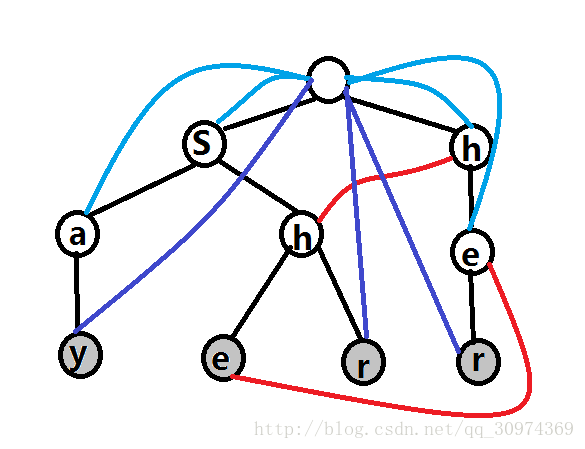

# 选题：自拟题目，属于字符串匹配算法

## 题目描述

老师提供一份学生的人数和名单，然后点名。而你需要告诉老师他有没有点错名。

## 输入格式

第一行一个整数 n，表示班上人数。

接下来 n 行，每行一个字符串表示其名字（互不相同，且只含小写字母，长度不超过 50）。

第 n+2 行一个整数 m，表示老师报的名字个数。

接下来 m 行，每行一个字符串表示老师报的名字（只含小写字母，且长度不超过 50）。

## 输出格式

对于每个老师报的名字，输出一行。

如果该名字正确且是第一次出现，输出 `OK`，如果该名字错误，输出 `WRONG`，如果该名字正确但不是第一次出现，输出 `REPEAT`。

## 输入输出样例

**输入** 

> 5
> a
> b
> c
> ad
> acd
> 3
> a
> a
> e

**输出** 

> OK
> REPEAT
> WRONG

## 数据范围

-   对于 40% 的数据，$n≤1000，m≤2000$。
-   对于 70% 的数据，$n\le 10^4，m\le 2\times 10^4$。
-   对于 100% 的数据，$n\le 10^4，m≤10^5$​。

# 分析

 本题的题意很简洁明了，就是给你n个模式串，m个主串，做字符串匹配。

用按位比较（也就是c语言标准库中strcmp）的方法，我们很快能[写出程序](1.bruteForce.c)。

显然，本算法效率过低。以1.2秒为时限，仅能通过n，m较小时数据。

与kmp算法要解决的问题不同，本题中，串的长度不是问题，问题在于有大量主串、大量模式串。

**复杂度分析：**每个主串都得跟n个模式串匹配，即使每次都在第一个字母处错配，也要m*n的复杂度，已经超时。最差情况，主串要与每个模式串的每个字母比较。复杂度如下表：

|情况|时间复杂度|
|-|-|
|最好(一次都不对)|$O(m \cdot n)$​​|
|平均/最差|$O(m \cdot \sum |s|)$​​​|

# 哈希+数字指纹

百度网盘有一种“极速秒传”功能，可以在上传较大文件前，检索服务器上是否存过此文件，如果有就直接保存快捷方式，跳过实际的上传过程，节约用户时间、服务器带宽。^[1]^  这里是用到了被称作“重删”的技术。^[2]^ 那么“重删”中，如何判断文件是否已上传过呢？这就用到了数字指纹。用一个很小的数据来标记一个文件的唯一信息。而哈希函数就是理想的数字指纹生成方式。

类似的，我们可以存储每个主串的哈希值，然后仅需搜索哈希值即可。

据参考文献介绍，百度网盘使用的哈希函数是MD5算法。更好的哈希函数是SHA-256，在$4.8*10^{29}$个数据中，出现​碰撞的概率小于$10^{-18}$​​​​。对于一个SHA-256值的集合，适合使用c++自带的红黑树来进行维护（\<set\>库）。但根据课程要求，不能使用c++的STL库，我的水平不足以用c语言高效稳定的自主实现红黑树，所以需要另辟蹊径。

我选择的是用哈希值作为数组下标，默认数组填0，每个模式串的哈希值对应的数组元素记为1。而主串的哈希值，对应的数组元素若非0，则说明访问过。这样，因为对数组的访问是O(1)的，时间复杂度仅由哈希函数决定。

为了使字符串的每一位变化，都会改变哈希值，且不同位置对哈希值的影响还不同，我设计了如下的多项式哈希函数。式中M和p设置为互质的大质数，可以保证哈希函数的均匀性。^[3]^
$$
\begin{aligned}
hash(s)&=s_0+s_1\cdot p+s_2\cdot p^2+\cdots+s_n\cdot p^n\mod M\\
&=\sum_{i=0}^ns_n\cdot p^n\mod M
\end{aligned}
$$

式中的M决定的哈希值的范围。由于哈希值用作下标，而数组不能过大，不然会超出Windows分配的栈空间。我选取了M=1000003，p=2003。

题中要输入$10^5$​这个数量级的数目的个字符串，M只能取到$10^6$​​​​这个数量级，因此碰撞几率比较大，如果采用单链表解决碰撞，在较多数据堆积在一起时，还是会退化成方法一的情况。

|情况|时间复杂度|
|-|-|
|最好|$O(m+ \sum |s|))$​​​|
|平均/最差|$O(m \cdot \sum|s|)$​|

经测试，对于样例可以通过，但n、m较大时，碰撞比较频繁，效率优化不大。

# 字典树

为了进一步优化算法效率，在此引入一种数据结构：**字典树**。节点代表字母，从根结点到标记结点的路径就代表了一个字符串

对于如下的样例，构建的字典树如图

> 5
> a
> b
> c
> ad
> acd
> 3
> a
> a
> e

左边为逻辑结构 **树**，右边存储方法 **二叉链表/孩子兄弟表示法**（没标出来的指针统统指向NULL）

这种方法，每个主串只需要从树根开始，依此往下走，最多走过最长的那个模式串的长度。

为了建立合法的字典树，需要先进行预处理。复杂度相当于遍历了模板串的每个字母。

|情况|时间复杂度|
|-|-|
|最好(一次都不对)|$O(m)$​|
|平均/最差|$O(m \cdot \max|s|)$​​​|
|建树(预处理)|$O(\sum |s|)$​|

定义一个节点，包括存所代表字母的一个char；两个bool值，一个标记此字母是否为单词结尾，一个存是否已点过此名；两个指针，指向低于个子节点，和下一个兄弟节点。

建树时，对每个模板串，从根节点起，一个节点往下走一步，若树上没有此节点就插入新节点。若走到字符串尾则记录单词结尾的bool值设为1。

查询时，对每个主串，从根节点往下走，结尾时，所在节点记录单词结尾的bool值，为1时则说明是匹配的。

# 结果

三种方法，样例运行结果相同。

# AC自动机（展望）

若是主串很长，可以**在字典树上用KMP算法**，这就是AC自动机。

KMP算法中，失配时，模式串的指针要跳转到当前位置的next位置。

我们在字典树上，也记录next位置（以指针形式），算法类似KMP

可用于分词（词频统计）

# 参考文献

[1] stormfeng，《百度云盘- 秒传探秘》， https://www.zhihu.com/question/21275365/answer/647397762 ，2021.12.25

[2] 煮酒论IT，《浅谈存储重删压缩技术》， https://blog.51cto.com/u_13559412/2057144 ，2021.12.25

[3]张焕国，《密码学引论》，武汉：武汉大学出版社，2009.3
