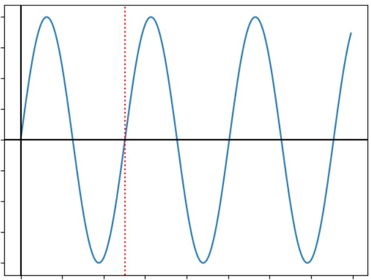
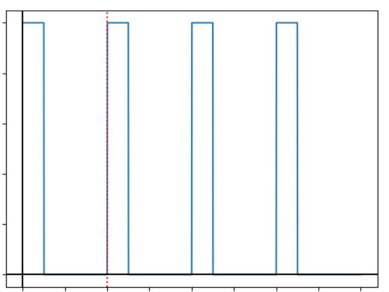
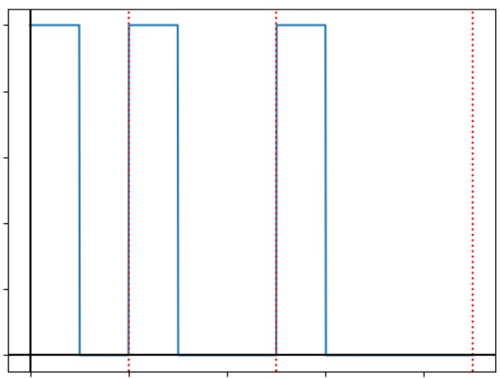
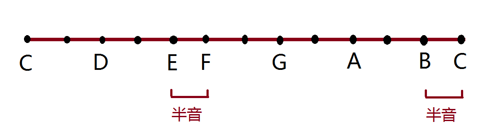

在第四周的《开源硬件与创客》课上，我们学习了蜂鸣器的使用。之后，我想，是否可以利用Arduino和蜂鸣器模块，播放简单的音乐。

### 播放不同周期的声音

上课时，老师的示例代码，是利用pwm技术，把模拟量转化成周期固定，脉冲宽度不同的一簇脉冲。这样可以得到音调固定，音量不同的声音。但对于乐声，我们需要不同的周期，从而实现不同音调。





开发板上的蜂鸣器元件，只能通过控制高低电平，来取得方波声音。因此我们不能用现成的pwm，而是自己编写程序输出数字信号。我选择固定波峰长度，调整波谷长度，以此得到周期不同的声音。

具体实现时，我联想到了数论中的“埃氏筛”算法，每一轮把某个数的倍数全部筛选出来。被筛出的时间段作为波峰，剩下的时间段作为波谷。经过实验，我们成功模拟了警笛声，说明这种方法是可行的。实验的代码（片段）如下：


```cpp
for(int i=2;i<10;i++)
    for(int j=0;j<100;j++){
        digitalWrite(Buzzer,j%i==0);
        delay(1);
    }
```

产生如图波形：



由此，我写出了c语言函数，用来播放给定周期的声音：

```cpp
void play(long time,int period){
	if(period==0){	//休止符
		delay(time);
		return;
	}
	digitalWrite(Led,HIGH);
	for(long i=0;i<time*20;i++){
		if(i%(period/35))
			digitalWrite(Buzzer,LOW);
		else
			digitalWrite(Buzzer,HIGH);
	}
	digitalWrite(Led,LOW);
}
```

由于蜂鸣器本身的性能限制，不能过于频繁的向其发送数字信号，否则蜂鸣器会“罢工”。经过精心调试，我们选出了20、35这两个参数，顺利解决了问题。

### 乐声的理论基础

但是，音乐比警笛声复杂得多。一个问题是，乐谱中记录的是do re mi这样的音符，而不是周期。所以我们需要了解，周期与音符的关系。幸运的是，乐理学知识可以解决这个问题。

明代学者发现，每12个音阶，琴弦长度差两倍。每个音阶对应的琴弦长度符合等比数列，公比$q=2^{\frac1{12}}\approx1.059$。这便是著名的**十二平均律**。物理分析表明，琴弦长度又和乐声频率成正比，频率和周期成反比。因此，每提高一个音阶，周期就差$ \frac1q $倍。而不同的调式又会选择几个特定的音阶，成为音符。下图是C大调时，音符对应的音阶。



使用python，我算出了各个音符对应的周期（单位：微秒）

```python
q=2**(1/12)
print(q)
n=440.0
feq=[0,2,4,5,7,9,11]
c=0
for i in range(13):
    if (i%12)in feq:
        c+=1
        print(int(1e6/n),end=',')
    n*=q
#运行结果为2272,2024,1803,1702,1516,1351,1203,1136
```

我们用常量数组来保存音符到周期的对应关系：

```c
const int toneToPeriod[]={0,2272,2024,1803,1702,1516,1351,1203,1136};
```

### Music!

最后一个小问题是，如何将乐谱存储到单片机中。我选择了常量数组作为乐谱的数据结构。

```c
const int starWars[]={1,0,5,0,4,3,2,8,0,5,0,4,3,2,8,0,5,0,4,3,4,2,-1};
const int twoTigers[]={1,2,3,1,1,2,3,1,3,4,5,0,3,4,5,0,5,6,5,4,3,0,1,0,5,6,5,4,3,0,1,0,2,1,1,0,2,1,1,-1};
```

完成了以上工作后，我们终于可以播放真正的音乐了。以下代码会播放《星球大战》片头曲的一部分。

```cpp
for(int i=0;starWars[i]!=-1;i++){
    play(300,toneToPeriod[starWars[i]]);
    delay(50);
}
```

我们甚至可以在不大改程序的条件下更换乐谱，只需修改代码中的staeWars数组的即可。
