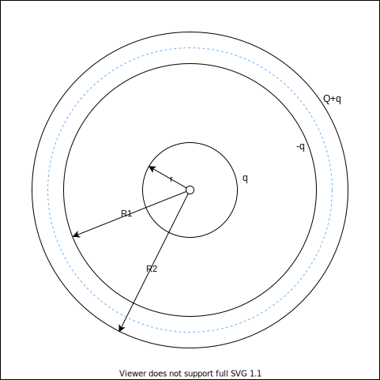

约定$k=\frac 1{4\pi\epsilon_0}$（只是为了缩短公式）

若有一球面均匀带电q，半径为R，在球面外距离球心r处有电场$E=\frac{kq}{r^2}$（由高斯定理可证）
这与点电荷电场公式相同。因此，在球面外r处，有电势$U_外=\frac{kq}r$

球面内，场强处处为0，因此球面内等势，$U_内=\frac{kq}R$。

综上，均匀带电q，半径为R的薄球壳，距离球心r处有电势

$$
U(r)=\begin{cases}
\frac{kq}r&,r>R\\
\frac{kq}R&,r<=R
\end{cases}
$$

金属（导体）内部都是电场为0、等势的。对于球型导体，因为同性相斥，电荷集中在外表面。

球壳内电场为0，在球壳内画一个高斯面（如图，蓝色虚线），由于高斯面上场强为0，通量为0，因此内部总电荷为0。因为内部的球带电q，所以球壳内表面带电-q。
相当于有 半径R2带电q+Q、半径R1带电-q、半径r带电q 的3个球面。

把距离r、R1、R2分别带入并求和即可求出前两问。