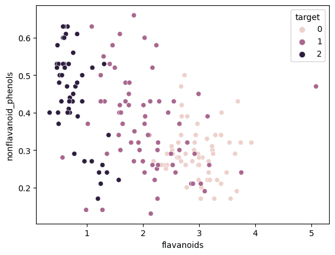

# 1. 绪论

## 1.1 题目

1. 实现K-means聚类算法
2. 实现ISODATA动态聚类算法
3. 对irisdataset进行动态聚类分析，并对两种算法的实验结果进行对比分析
4. 完成Wine Data Set的分类实验

## 1.2 背景

### 1.2.1 K-means聚类

k均值算法，是最基础的无监督聚类算法之一。将数据聚类为k个簇。每个簇中数据值的均值，作为该簇的中心，称为质心。

算法思想大致为：

1. 从样本集中随机选取 k个样本作为簇中心
2. 计算所有样本与这 k个“簇中心”的距离
3. 将每一个样本，划分到与其距离最近的“簇中心”所在的簇中
4. 对于新的簇计算各个簇的新的“簇中心”
5. 重复上述2~4过程，直至"簇中心"没有移动

### 1.2.2 ISODATA动态聚类

全称迭代自组织数据分析法。属于K-means的改进。

和K-Means一样，都是对于每个簇，选取一个中心点，使得每个点到簇的中心距离最短。抽象的说，二者最优化的目标函数一样，都是

大体思路是，先任选k个点，作为初始的聚类中心，然后通过迭代，不断调整这些类别中心，直到得到最好的聚类中心为止。不同的是，ISODATA的聚类的类别数目随着聚类的进行而变化，多出了合并和分裂的操作。**合并**是当聚类结果某一类中样本数太少，或两个类间的距离太近时，将两类合并成一个类；**分裂**是当聚类结果某一类的类内方差太大，将该类分裂成两个类。

ISODATA有7个初始变量: 6个初始参数(K,k,θN,θc,θs,L,I): 

> K: 期望得到的聚类数；
> k: 初始的设定的聚类数；
> θN: 每一个类别中最少的样本数，若少于此数则去掉该类别；
> θs: 一个类别中，样本特征中最大标准差。若大于这个值，则可能分裂；
> θc: 两个类别中心间的最小距离，若小于此数，把两个类别需进行合并；
> L: 在一次合并操作中，可以合并的类别的最多对数；
> I: 迭代运算的次数。

具体的步骤是：

1. 任选k个点，作为初始的聚类中心

2. 将每个样本，分给最近的聚类中心

3. 去掉那些类别中样本数小于N的类别

4. 更新各个类的中心（同K-Means一样，算术平均）

5. 计算每个类所有样本到其中心的平均距离，并对所有类加权平均

6. 判断停止、分裂或合并
   若迭代次数I = NS，则算法结束；
   若k <= K/2，则转到7（将一些类分裂）；
   若k >= 2K，则转至8（跳过分裂处理）；
   若K/2 < k < 2K，当迭代次数I是奇数时转至7（分裂处理）；迭代次数I是偶数时转至8（合并处理）。
   
7. **分裂**，求每个类别中每个分量的标准差，取最大值。如果最大值大于θS，且满足如下两个条件之一
   1. 组内平均距离>总平均距离，且样本总数超过规定值θN一倍以上
   2. 总组数小于预期的聚类中心数目K的一半
   则分裂为两个新的聚类中心并转至步骤2

8. **合并**，计算全部聚类中心的距离，从小到大将小于θc的一对聚类中心合并

9. 迭代次数I+1，回到步骤2

以上步骤换成流程图形式，如下


### 1.2.3 iris数据集

全名Edgar Anderson's Iris Data，是一个关于鸢尾花的多分类数据集。

包含150个样本，每个样本包含了花萼长度、花萼宽度、花瓣长度、花瓣宽度四个特征，我们需要建立一个分类器，判断样本属于山鸢尾、变色鸢尾还是维吉尼亚鸢尾（三个品种）。

### 1.2.4 wine数据集

Wine葡萄酒数据集，是对意大利同一地区种植的葡萄酒进行化学分析的结果。也是多分类数据集。

包含178个样本，每个样本含有13个特征分量(化学成分)，分别属于三个类别。

# 2. 具体过程、方案

## 2.1 数据获取与处理

### 2.1.1 iris数据集

使用scikit-learn库中自带的`datasets.load_iris()`数据。

```python
iris=datasets.load_iris()
l=pd.DataFrame(iris['data'],columns=iris['feature_names'])
r=pd.DataFrame(iris['target'],columns=['target'])
data=pd.merge(l,r,left_index=True, right_index=True)
```

任取其中5个数据查看（目标一栏的0，1，2分别代表'setosa' 'versicolor' 'virginica'）：


描述性统计如下


计算相关系数并画出热力图。由热力图可见，`sepal_length`、`petal_length`、`petal_width`与结果显著正相关。`sepal_width`则与结果负相关。


做散点图。可以看出，选取合适的分量，可以使得同一分类的数据，集中程度较高。

  

### 2.1.2 wine数据集

类似的，使用scikit-learn库中自带的`datasets.load_wine()`

任取其中5个数据查看

|      | alcohol | malic_acid |  ash | alcalinity_of_ash | magnesium | total_phenols | flavanoids | nonflavanoid_phenols | proanthocyanins | color_intensity |  hue | od280/od315_of_diluted_wines | proline | target |
| ---: | ------: | ---------: | ---: | ----------------: | --------: | ------------: | ---------: | -------------------: | --------------: | --------------: | ---: | ---------------------------: | ------: | ------ |
|  151 |   12.79 |       2.67 | 2.48 |              22.0 |     112.0 |          1.48 |       1.36 |                 0.24 |            1.26 |           10.80 | 0.48 |                         1.47 |   480.0 | 2      |
|   20 |   14.06 |       1.63 | 2.28 |              16.0 |     126.0 |          3.00 |       3.17 |                 0.24 |            2.10 |            5.65 | 1.09 |                         3.71 |   780.0 | 0      |
|  158 |   14.34 |       1.68 | 2.70 |              25.0 |      98.0 |          2.80 |       1.31 |                 0.53 |            2.70 |           13.00 | 0.57 |                         1.96 |   660.0 | 2      |
|   74 |   11.96 |       1.09 | 2.30 |              21.0 |     101.0 |          3.38 |       2.14 |                 0.13 |            1.65 |            3.21 | 0.99 |                         3.13 |   886.0 | 1      |
|   24 |   13.50 |       1.81 | 2.61 |              20.0 |      96.0 |          2.53 |       2.61 |                 0.28 |            1.66 |            3.52 | 1.12 |                         3.82 |   845.0 | 0      |

描述性统计

|       |    alcohol | malic_acid |        ash | alcalinity_of_ash |  magnesium | total_phenols | flavanoids | nonflavanoid_phenols | proanthocyanins | color_intensity |        hue | od280/od315_of_diluted_wines |     proline | target     |
| ----: | ---------: | ---------: | ---------: | ----------------: | ---------: | ------------: | ---------: | -------------------: | --------------: | --------------: | ---------: | ---------------------------: | ----------: | ---------- |
| count | 178.000000 | 178.000000 | 178.000000 |        178.000000 | 178.000000 |    178.000000 | 178.000000 |           178.000000 |      178.000000 |      178.000000 | 178.000000 |                   178.000000 |  178.000000 | 178.000000 |
|  mean |  13.000618 |   2.336348 |   2.366517 |         19.494944 |  99.741573 |      2.295112 |   2.029270 |             0.361854 |        1.590899 |        5.058090 |   0.957449 |                     2.611685 |  746.893258 | 0.938202   |
|   std |   0.811827 |   1.117146 |   0.274344 |          3.339564 |  14.282484 |      0.625851 |   0.998859 |             0.124453 |        0.572359 |        2.318286 |   0.228572 |                     0.709990 |  314.907474 | 0.775035   |
|   min |  11.030000 |   0.740000 |   1.360000 |         10.600000 |  70.000000 |      0.980000 |   0.340000 |             0.130000 |        0.410000 |        1.280000 |   0.480000 |                     1.270000 |  278.000000 | 0.000000   |
|   25% |  12.362500 |   1.602500 |   2.210000 |         17.200000 |  88.000000 |      1.742500 |   1.205000 |             0.270000 |        1.250000 |        3.220000 |   0.782500 |                     1.937500 |  500.500000 | 0.000000   |
|   50% |  13.050000 |   1.865000 |   2.360000 |         19.500000 |  98.000000 |      2.355000 |   2.135000 |             0.340000 |        1.555000 |        4.690000 |   0.965000 |                     2.780000 |  673.500000 | 1.000000   |
|   75% |  13.677500 |   3.082500 |   2.557500 |         21.500000 | 107.000000 |      2.800000 |   2.875000 |             0.437500 |        1.950000 |        6.200000 |   1.120000 |                     3.170000 |  985.000000 | 2.000000   |
|   max |  14.830000 |   5.800000 |   3.230000 |         30.000000 | 162.000000 |      3.880000 |   5.080000 |             0.660000 |        3.580000 |       13.000000 |   1.710000 |                     4.000000 | 1680.000000 | 2.000000   |

作相关系数热力图，参数较多，无法直观看出规律


取与结果相关度绝对值较大，影响较大的两个参数画散点图。可以看出，参数较多时，只用部分参数不能很方便的分类。



## 2.2 K-means聚类

选用欧拉距离作为距离评判标准，以下代码即为K-means聚类的实现

```python
import random
import pandas as pd
import numpy as np
import matplotlib.pyplot as plt

# 计算欧拉距离
def calcDis(dataSet, centroids, k):
    clalist=[]
    for data in dataSet:
        diff = np.tile(data, (k, 1)) - centroids
        squaredDiff = diff ** 2
        squaredDist = np.sum(squaredDiff, axis=1)
        distance = squaredDist ** 0.5
        clalist.append(distance) 
    clalist = np.array(clalist)
    return clalist

# 计算质心
def classify(dataSet, centroids, k):
    clalist = calcDis(dataSet, centroids, k)
    minDistIndices = np.argmin(clalist, axis=1) 
    newCentroids = pd.DataFrame(dataSet).groupby(minDistIndices).mean()
    newCentroids = newCentroids.values
    changed = newCentroids - centroids
    return changed, newCentroids

# 调用k-means
def kmeans(dataSet, k):
    # 随机取质心
    centroids = random.sample(dataSet, k)
    
    # 更新质心 直到变化量全为0
    changed, newCentroids = classify(dataSet, centroids, k)
    while np.any(changed != 0):
        changed, newCentroids = classify(dataSet, newCentroids, k)
 
    centroids = sorted(newCentroids.tolist())
 
    # 根据质心计算每个集群
    cluster = []
    clalist = calcDis(dataSet, centroids, k)
    minDistIndices = np.argmin(clalist, axis=1)  
    for i in range(k):
        cluster.append([])
    for i, j in enumerate(minDistIndices):
        cluster[j].append(dataSet[i])
        
    return centroids, cluster

dataset = iris
centroids, cluster = kmeans(dataset, 4)
print(centroids)
print(cluster)
for i in range(len(dataset)):
  plt.scatter(dataset[i][0],dataset[i][1], marker = 'o',color = 'green', s = 40 ,label = '原始点')
  for j in range(len(centroids)):
    plt.scatter(centroids[j][0],centroids[j][1],marker='x',color='red',s=50,label='质心')
    plt.show()
```

结果：


计算得到的中心点如下

```
[[5.006      3.428      1.462      0.246     ]
 [5.9016129  2.7483871  4.39354839 1.43387097]
 [6.85       3.07368421 5.74210526 2.07105263]]
```

## 2.3 ISODATA动态聚类

实现代码如下

```python
from sklearn.metrics import euclidean_distances

class ISODATA():
    def __init__(self, data:tuple, designCenterNum, LeastSampleNum, StdThred, LeastCenterDist, iterationNum):
        '数据、预期的聚类数、每类最小样本数、标准差阈值、最小中心距离、迭代次数'
        self.K = designCenterNum
        self.thetaN = LeastSampleNum
        self.thetaS = StdThred
        self.thetaC = LeastCenterDist
        self.iteration = iterationNum

        # 初始化
        self.data, self.label = data

        self.center = self.data[0, :].reshape((1, -1))
        self.centerNum = 1
        self.centerMeanDist = 0

        # seaborn风格
        sns.set()

    def updateLabel(self):
        """
            更新中心
        """
        for i in range(self.centerNum):
            # 计算样本到中心的距离
            distance = euclidean_distances(self.data, self.center.reshape((self.centerNum, -1)))
            # 为样本重新分配标签
            self.label = np.argmin(distance, 1)
            # 找出同一类样本
            index = np.argwhere(self.label == i).squeeze()
            # print(i,index)
            # print('label',self.label)
            # print('index',index)
            sameClassSample = self.data[index, :]
            # 更新中心
            self.center[i, :] = np.mean(sameClassSample, 0)
            # print(self.center)
        # print('poipoipoi',self.center.shape[0],self.centerNum)
        for i in range(self.center.shape[0]):
            # print('center',self.center[i, :])
            if np.isnan(self.center[i,0]):
                # print('VEVEVEVE',i)
                self.center=np.vstack((self.center[:i,:],self.center[i+1:,:]))
                self.centerNum-=1
                # print('center2',self.center)
        # 计算所有类到各自中心的平均距离之和
        for i in range(self.centerNum):
            # 找出同一类样本
            index = np.argwhere(self.label == i).squeeze()
            # print('i',index.shape)
            # if index.shape==(0,):
            #     self.centerNum=i
            #     break
            sameClassSample = self.data[index, :]
            # 计算样本到中心的距离
            # print(sameClassSample.shape)
            # print(self.center[i, :].reshape((1, -1)).shape)
            # print(sameClassSample)
            # print(self.center[i, :].reshape((1, -1)))
            distance = np.mean(euclidean_distances(sameClassSample, self.center[i, :].reshape((1, -1))))
            # 更新中心
            self.centerMeanDist += distance
        self.centerMeanDist /= self.centerNum

    def divide(self):
        # 临时保存更新后的中心集合,否则在删除和添加的过程中顺序会乱
        newCenterSet = self.center
        # 计算每个类的样本在每个维度的标准差
        for i in range(self.centerNum):
            # 找出同一类样本
            index = np.argwhere(self.label == i).squeeze()
            sameClassSample = self.data[index, :]
            # 计算样本到中心每个维度的标准差
            stdEachDim = np.mean((sameClassSample - self.center[i, :])**2, axis=0)
            # 找出其中维度的最大标准差
            maxIndex = np.argmax(stdEachDim)
            maxStd = stdEachDim[maxIndex]
            # 计算样本到本类中心的距离
            distance = np.mean(euclidean_distances(sameClassSample, self.center[i, :].reshape((1, -1))))
            # 如果最大标准差超过了阈值
            if maxStd > self.thetaS:
                # 还需要该类的样本数大于于阈值很多 且 太分散才进行分裂
                if self.centerNum <= self.K//2 or \
                        sameClassSample.shape[0] > 2 * (self.thetaN+1) and distance >= self.centerMeanDist:
                    newCenterFirst = self.center[i, :].copy()
                    newCenterSecond = self.center[i, :].copy()

                    newCenterFirst[maxIndex] += 0.5 * maxStd+1
                    newCenterSecond[maxIndex] -= 0.5 * maxStd+1

                    # 删除原始中心
                    newCenterSet = np.delete(newCenterSet, i, axis=0)
                    # 添加新中心
                    newCenterSet = np.vstack((newCenterSet, newCenterFirst))
                    newCenterSet = np.vstack((newCenterSet, newCenterSecond))

            else:
                continue
        # 更新中心集合
        self.center = newCenterSet
        self.centerNum = self.center.shape[0]

    def combine(self):
        # 临时保存更新后的中心集合,否则在删除和添加的过程中顺序会乱
        delIndexList = []

        # 计算中心之间的距离
        centerDist = euclidean_distances(self.center, self.center)
        centerDist += (np.eye(self.centerNum)) * 10**10
        # 把中心距离小于阈值的中心对找出来
        while True:
            # 如果最小的中心距离都大于阈值的话，则不再进行合并
            minDist = np.min(centerDist)
            if minDist >= self.thetaC:
                break
            # 否则合并
            index = np.argmin(centerDist)
            row = index // self.centerNum
            col = index % self.centerNum
            # 找出合并的两个类别
            index = np.argwhere(self.label == row).squeeze()
            classNumFirst = len(index)
            index = np.argwhere(self.label == col).squeeze()
            classNumSecond = len(index)
            newCenter = self.center[row, :] * (classNumFirst / (classNumFirst+ classNumSecond)) + \
                        self.center[col, :] * (classNumSecond / (classNumFirst+ classNumSecond))
            # 记录被合并的中心
            delIndexList.append(row)
            delIndexList.append(col)
            # 增加合并后的中心
            self.center = np.vstack((self.center, newCenter))
            self.centerNum -= 1
            # 标记，以防下次选中
            centerDist[row, :] = float("inf")
            centerDist[col, :] = float("inf")
            centerDist[:, col] = float("inf")
            centerDist[:, row] = float("inf")

        # 更新中心
        self.center = np.delete(self.center, delIndexList, axis=0)
        self.centerNum = self.center.shape[0]

    def drawResult(self,i):
        ax = plt.gca()
        # ax.clear()
        ax.scatter(self.data[:, 2], self.data[:, 3], c=self.label, cmap="cool")
        x=[i[2] for i in self.center]
        y=[i[3] for i in self.center]
        ax.scatter(x,y,marker='*',s=200,c='green')
        ax.set_title('iter:'+str(i)+'  '+'centerNum:'+str(self.centerNum))
        # plt.show()


    def train(self):
        # 初始化中心和label
        self.updateLabel()
        # fig,subs=plt.subplots(4,3)
        plt.figure(figsize=(20,25))
        plt.subplot(4,5,1)
        self.drawResult(0)

        # 到设定的次数自动退出
        for i in range(self.iteration):
            # print('qweqweqwe',self.centerNum)
            # print(self.center)
            # 如果是偶数次迭代或者中心的数量太多，那么进行合并
            if self.centerNum < self.K //2:
                self.divide()
                # print('divide1', self.centerNum)
            elif (i > 0 and i % 2 == 0) or self.centerNum > 2 * self.K:
                self.combine()
                # print('combine', self.centerNum)
            else:
                self.divide()
                # print('divide2', self.centerNum)
            # 更新中心
            # print('asdasdasd',self.centerNum)
            # print(self.center)
            self.updateLabel()
            # print('zxczxczxc',self.centerNum)
            # print(self.center)
            plt.subplot(4,5,i+1)
            self.drawResult(i)
        plt.show()
```

迭代过程如下


得到的中心点如下

```
[[5.00408163 3.42653061 1.46326531 0.24693878]
 [6.87027027 3.08648649 5.74594595 2.08918919]
 [5.90068783 2.75329101 4.38346032 1.43014815]]
```

## 2.4 wine数据集

### 2.4.1 K-means

得到的中心点：

```
[[1.25166667e+01 2.49420290e+00 2.28855072e+00 2.08231884e+01
  9.23478261e+01 2.07072464e+00 1.75840580e+00 3.90144928e-01
  1.45188406e+00 4.08695651e+00 9.41159420e-01 2.49072464e+00
  4.58231884e+02]
 [1.38044681e+01 1.88340426e+00 2.42617021e+00 1.70234043e+01
  1.05510638e+02 2.86723404e+00 3.01425532e+00 2.85319149e-01
  1.91042553e+00 5.70255319e+00 1.07829787e+00 3.11404255e+00
  1.19514894e+03]
 [1.29298387e+01 2.50403226e+00 2.40806452e+00 1.98903226e+01
  1.03596774e+02 2.11112903e+00 1.58403226e+00 3.88387097e-01
  1.50338710e+00 5.65032258e+00 8.83967742e-01 2.36548387e+00
  7.28338710e+02]]
```

结果如下，可以看出结果准确度一般


### 2.4.2 ISODATA

中心点：

```
[[1.35669101e+01 2.06910350e+00 2.42840165e+00 1.78421823e+01
  1.07376642e+02 2.66345229e+00 2.62604605e+00 3.08617661e-01
  1.82240703e+00 5.58391676e+00 1.01990774e+00 2.94100965e+00
  1.06749145e+03]]
```

 

出乎意料的，无论怎么调参，结果都出现只有一类的情况。反复检查代码，没有问题。具体表现在，拆分中心点后，两个新的中心出现“一家独大”的情况，较小的中心立刻又被合并了。因此结果极差。

# 3. 结果分析

对于分类器，我们可以用混淆矩阵，进行性能度量

|       | 预测1 | 预测2 | 预测3 | 预测4 |
| ----- | ----- | ----- | ----- | ----- |
| 真实1 | $T_1P_1$  | $F_1P_2$  | $F_1P_3$  | $F_1P_4$  |
| 真实2 | $F_2P_1$  | $T_2P_2$  | $F_2P_3$  | $F_2P_4$  |
| 真实3 | $F_3P_1$  | $F_3P_2$  | $T_3P_3$  | $F_3P_4$  |
| 真实4 | $F_4P_1$  | $F_4P_2$  | $F_4P_3$  | $T_4P_4$  |

我们设
$$
\begin{aligned}
TP_i&=T_iP_i\\
FP_i&=\sum_{j=1,j\neq i}^nF_jP_i\\
FN_i&=\sum_{j=1,j\neq i}^nF_iP_j
\end{aligned}
$$

最简单的性能度量，是**准确率**，指分类正确的样本数占总样本数的比例
$$
acc=\frac{\sum_{i=1}^n TP_i}{\sum_{i=1}^n TP_i+FP_i}
$$

我们也可以先在n个二分类的混淆矩阵上计算出查准率和查全率，再计算平均查准率和平均查全率（加权平均），即可得到**macro度量**

**macro查准率**是预测结果为正例中实际正例的占比：
$$
macroP=\frac1n\sum_{i=1}^n\frac{TP_i}{TP_i+FP_i}
$$
**macro查全率**是真实情况为正例中预测正例的占比：
$$
macroR=\frac1n\sum_{i=1}^n\frac{TP_i}{TP_i+FN_i}
$$

**macroF1-score**是查准率与查全率的调和平均，是综合性的评价指标。
$$
\begin{aligned}
F_{1i}=&\frac2{\frac1P+\frac1R}\\
macroF_1=&\frac1n\sum_{i=1}^n F_{1i}
\end{aligned}
$$

k-means在iris上的结果：

```
[[50  0  0]
 [ 0 48  2]
 [ 0 14 36]]
              precision    recall  f1-score   support

           0       1.00      1.00      1.00        50
           1       0.77      0.96      0.86        50
           2       0.95      0.72      0.82        50

    accuracy                           0.89       150
   macro avg       0.91      0.89      0.89       150
weighted avg       0.91      0.89      0.89       150
```


ISODATA在iris上的结果：

```
[[49  1  0]
 [ 0 48  2]
 [ 0 14 36]]
              precision    recall  f1-score   support

           0       1.00      0.98      0.99        50
           1       0.76      0.96      0.85        50
           2       0.95      0.72      0.82        50

    accuracy                           0.89       150
   macro avg       0.90      0.89      0.89       150
weighted avg       0.90      0.89      0.89       150
```


二者无显著差距。在结果相差不大的情况下，我们应该使用简单的模型。

k-means在wine上的结果：

```
[[46  0 13]
 [ 1 50 20]
 [ 0 19 29]]
              precision    recall  f1-score   support

           0       0.98      0.78      0.87        59
           1       0.72      0.70      0.71        71
           2       0.47      0.60      0.53        48

    accuracy                           0.70       178
   macro avg       0.72      0.70      0.70       178
weighted avg       0.74      0.70      0.71       178
```


ISODATA在wine上的结果：

```
[[59  0  0]
 [71  0  0]
 [48  0  0]]
              precision    recall  f1-score   support

           0       0.33      1.00      0.50        59
           1       0.00      0.00      0.00        71
           2       0.00      0.00      0.00        48

    accuracy                           0.33       178
   macro avg       0.11      0.33      0.17       178
weighted avg       0.11      0.33      0.17       178
```


ISODATA出现严重的欠拟合情况，而且反复调参效果不佳。这警示我们，谨慎使用复杂模型，尤其是超参数较多，调参难度大的模型。

# 4. 总结

K-means聚类，是最简单的聚类算法之一。但是，它有一些缺点：作为无监督学习，可能无法事先确定，样本中到底有多少类别，K取多大；对初始化敏感，初始质点k给定的不同，可能会产生不同的聚类结果；不适合非球状的数据分布；可能陷入局部最优解。
优化的方案也有一些，比如，多次设不同的初始值，取总距离最小的结果；选取不同的K，多次调参；引入二分算法，多层级的聚类，每次选择使得SSE下降程度最大的簇并拆开，直到簇的个数达到指定的数目；合理选择初始值，尽量让开始时聚类中心均匀分布，这便是K-means++算法；引入Mini Batch批量运算，可以充分利用并行运算功能，显著提速。

ISODATA算法的原理类似K-means，不过需要额外指定较多的超参数，且很难准确指定出一个较合理的值，在实际过程中并不常见。此外，其本质上还是和k-means一样，目标是“欧氏空间上距离最近”，注定无法有突破性的提升。

本次实验中，ISODATA在wine上出现严重的欠拟合情况。这警示我们，谨慎使用复杂模型，尤其是超参数较多，调参难度大的模型。

事实上，下图列出了几种最为常用的聚类算法：


这是以上方法对应的超参数、适用范围等信息：

| Method name                                                  | Parameters                                                   | Scalability                                                  | Usecase                                                      | Geometry (metric used)                       |
| ------------------------------------------------------------ | ------------------------------------------------------------ | ------------------------------------------------------------ | ------------------------------------------------------------ | -------------------------------------------- |
| [K-Means](https://scikit-learn.org/stable/modules/clustering.html#k-means) | number of clusters                                           | Very large `n_samples`, medium `n_clusters` with [MiniBatch code](https://scikit-learn.org/stable/modules/clustering.html#mini-batch-kmeans) | General-purpose, even cluster size, flat geometry, not too many clusters, inductive | Distances between points                     |
| [Affinity propagation](https://scikit-learn.org/stable/modules/clustering.html#affinity-propagation) | damping, sample preference                                   | Not scalable with n_samples                                  | Many clusters, uneven cluster size, non-flat geometry, inductive | Graph distance (e.g. nearest-neighbor graph) |
| [Mean-shift](https://scikit-learn.org/stable/modules/clustering.html#mean-shift) | bandwidth                                                    | Not scalable with `n_samples`                                | Many clusters, uneven cluster size, non-flat geometry, inductive | Distances between points                     |
| [Spectral clustering](https://scikit-learn.org/stable/modules/clustering.html#spectral-clustering) | number of clusters                                           | Medium `n_samples`, small `n_clusters`                       | Few clusters, even cluster size, non-flat geometry, transductive | Graph distance (e.g. nearest-neighbor graph) |
| [Ward hierarchical clustering](https://scikit-learn.org/stable/modules/clustering.html#hierarchical-clustering) | number of clusters or distance threshold                     | Large `n_samples` and `n_clusters`                           | Many clusters, possibly connectivity constraints, transductive | Distances between points                     |
| [Agglomerative clustering](https://scikit-learn.org/stable/modules/clustering.html#hierarchical-clustering) | number of clusters or distance threshold, linkage type, distance | Large `n_samples` and `n_clusters`                           | Many clusters, possibly connectivity constraints, non Euclidean distances, transductive | Any pairwise distance                        |
| [DBSCAN](https://scikit-learn.org/stable/modules/clustering.html#dbscan) | neighborhood size                                            | Very large `n_samples`, medium `n_clusters`                  | Non-flat geometry, uneven cluster sizes, outlier removal, transductive | Distances between nearest points             |
| [OPTICS](https://scikit-learn.org/stable/modules/clustering.html#optics) | minimum cluster membership                                   | Very large `n_samples`, large `n_clusters`                   | Non-flat geometry, uneven cluster sizes, variable cluster density, outlier removal, transductive | Distances between points                     |
| [Gaussian mixtures](https://scikit-learn.org/stable/modules/mixture.html#mixture) | many                                                         | Not scalable                                                 | Flat geometry, good for density estimation, inductive        | Mahalanobis distances to  centers            |
| [BIRCH](https://scikit-learn.org/stable/modules/clustering.html#birch) | branching factor, threshold, optional global clusterer.      | Large `n_clusters` and `n_samples`                           | Large dataset, outlier removal, data reduction, inductive    | Euclidean distance between points            |
| [Bisecting K-Means](https://scikit-learn.org/stable/modules/clustering.html#bisect-k-means) | number of clusters                                           | Very large `n_samples`, medium `n_clusters`                  | General-purpose, even cluster size, flat geometry, no empty clusters, inductive, hierarchical | Distances between points                     |

可以看到，常用的方法，均在性能、复杂度、速度上做出了折衷。这也能符合我们的中庸之道。我们还要辩证的看待各类算法，具体问题具体分析，这样才能更快更好的解决实际问题。

# 参考文献

[1] 骁勇善栈.iris数据集及简介 https://blog.csdn.net/java1573/article/details/78865495 2022年12月访问

[2] Pandas官方中文文档 https://www.pypandas.cn/docs 2022年12月访问

[3] scikit-learn User Guide https://scikit-learn.org/stable/modules/clustering.html 2022年12月访问

[4] Aditya·Bhargava 算法图解 人民邮电出版社

[5] 加文·海克 scikit-learn机器学习 人民邮电出版社

[6] zsiming ISODATA算法 https://blog.csdn.net/zsiming/article/details/122410398 2022年12月访问

[7] 杨Zz K-means聚类算法原理 https://blog.csdn.net/qq_43741312/article/details/97128745 2022年12月访问

[8] 悟乙己 k-means+python︱scikit-learn中的KMeans聚类实现 https://blog.csdn.net/sinat_26917383/article/details/70240628 2022年12月访问

# 附录(完整的代码)

```python
# %%
import numpy as np
import pandas as pd
import seaborn as sns
from sklearn import datasets,cluster,metrics
import matplotlib.pyplot as plt

# %% [markdown]
# # 1. 数据获取与处理

# %% [markdown]
# ## 1.1 iris数据集

# %%
iris=datasets.load_iris()
iris.keys()
for i in range(4):
    iris['feature_names'][i]=iris['feature_names'][i][:-5]
print(iris.keys())
print(iris['target_names'])

# %%
l=pd.DataFrame(iris['data'],columns=iris['feature_names'])
r=pd.DataFrame(iris['target'],columns=['target'])
iris=pd.merge(l,r,left_index=True, right_index=True)
iris.sample(5)

# %%
iris.describe()

# %%
sns.heatmap(iris.corr(),cmap='Blues')
plt.show()

# %%
sns.scatterplot(data=iris,x='sepal length',y='sepal width',hue='target')
plt.show()

# %%
sns.scatterplot(data=iris,x='petal length',y='petal width',hue='target')
plt.show()

# %% [markdown]
# ## 1.2 wine数据集

# %%
wine=datasets.load_wine()
wine.keys()

# %%
l = pd.DataFrame(wine['data'], columns=wine['feature_names'])
r = pd.DataFrame(wine['target'], columns=['target'])
wine = pd.merge(l, r, left_index=True, right_index=True)
wine.sample(5)

# %%
wine.describe()

# %%
sns.heatmap(wine.corr(),cmap='Blues')
plt.show()

# %%
sns.scatterplot(data=wine,x='flavanoids',y='nonflavanoid_phenols',hue='target')
plt.show()

# %% [markdown]
# # 2. K-means聚类

# %%
km_cluster = cluster.KMeans(n_clusters=3, n_init=100)
data=datasets.load_iris(return_X_y=True)[0]
result = km_cluster.fit_predict(data)
ans1=datasets.load_iris(return_X_y=True)[1]
predect1=result
center1=km_cluster.cluster_centers_
print(center1)

# %%
sns.scatterplot(data=iris,x='sepal length',y='sepal width',hue='target')
x=[i[0] for i in center1]
y=[i[1] for i in center1]
plt.scatter(x,y,marker='*',s=200)
plt.show()

# %%
sns.scatterplot(data=iris,x='petal length',y='petal width',hue='target')
x=[i[2] for i in center1]
y=[i[3] for i in center1]
plt.scatter(x,y,marker='*',s=200)
plt.show()

# %% [markdown]
# # 3. ISODATA动态聚类

# %%
from sklearn.metrics import euclidean_distances

class ISODATA():
    def __init__(self, data:tuple, designCenterNum, LeastSampleNum, StdThred, LeastCenterDist, iterationNum):
        '数据、预期的聚类数、每类最小样本数、标准差阈值、最小中心距离、迭代次数'
        self.K = designCenterNum
        self.thetaN = LeastSampleNum
        self.thetaS = StdThred
        self.thetaC = LeastCenterDist
        self.iteration = iterationNum

        # 初始化
        self.data, self.label = data

        self.center = self.data[0, :].reshape((1, -1))
        self.centerNum = 1
        self.centerMeanDist = 0

        # seaborn风格
        sns.set()

    def updateLabel(self):
        """
            更新中心
        """
        for i in range(self.centerNum):
            # 计算样本到中心的距离
            distance = euclidean_distances(self.data, self.center.reshape((self.centerNum, -1)))
            # 为样本重新分配标签
            self.label = np.argmin(distance, 1)
            # 找出同一类样本
            index = np.argwhere(self.label == i).squeeze()
            # print(i,index)
            # print('label',self.label)
            # print('index',index)
            sameClassSample = self.data[index, :]
            # 更新中心
            self.center[i, :] = np.mean(sameClassSample, 0)
            # print(self.center)
        # print('poipoipoi',self.center.shape[0],self.centerNum)
        for i in range(self.center.shape[0]):
            # print('center',self.center[i, :])
            if np.isnan(self.center[i,0]):
                # print('VEVEVEVE',i)
                self.center=np.vstack((self.center[:i,:],self.center[i+1:,:]))
                self.centerNum-=1
                # print('center2',self.center)
        # 计算所有类到各自中心的平均距离之和
        for i in range(self.centerNum):
            # 找出同一类样本
            index = np.argwhere(self.label == i).squeeze()
            # print('i',index.shape)
            # if index.shape==(0,):
            #     self.centerNum=i
            #     break
            sameClassSample = self.data[index, :]
            # 计算样本到中心的距离
            # print(sameClassSample.shape)
            # print(self.center[i, :].reshape((1, -1)).shape)
            # print(sameClassSample)
            # print(self.center[i, :].reshape((1, -1)))
            distance = np.mean(euclidean_distances(sameClassSample, self.center[i, :].reshape((1, -1))))
            # 更新中心
            self.centerMeanDist += distance
        self.centerMeanDist /= self.centerNum

    def divide(self):
        # 临时保存更新后的中心集合,否则在删除和添加的过程中顺序会乱
        newCenterSet = self.center
        # 计算每个类的样本在每个维度的标准差
        for i in range(self.centerNum):
            # 找出同一类样本
            index = np.argwhere(self.label == i).squeeze()
            sameClassSample = self.data[index, :]
            # 计算样本到中心每个维度的标准差
            stdEachDim = np.mean((sameClassSample - self.center[i, :])**2, axis=0)
            # 找出其中维度的最大标准差
            maxIndex = np.argmax(stdEachDim)
            maxStd = stdEachDim[maxIndex]
            # 计算样本到本类中心的距离
            distance = np.mean(euclidean_distances(sameClassSample, self.center[i, :].reshape((1, -1))))
            # 如果最大标准差超过了阈值
            if maxStd > self.thetaS:
                # 还需要该类的样本数大于于阈值很多 且 太分散才进行分裂
                if self.centerNum <= self.K//2 or \
                        sameClassSample.shape[0] > 2 * (self.thetaN+1) and distance >= self.centerMeanDist:
                    newCenterFirst = self.center[i, :].copy()
                    newCenterSecond = self.center[i, :].copy()

                    newCenterFirst[maxIndex] += 0.5 * maxStd+1
                    newCenterSecond[maxIndex] -= 0.5 * maxStd+1

                    # 删除原始中心
                    newCenterSet = np.delete(newCenterSet, i, axis=0)
                    # 添加新中心
                    newCenterSet = np.vstack((newCenterSet, newCenterFirst))
                    newCenterSet = np.vstack((newCenterSet, newCenterSecond))

            else:
                continue
        # 更新中心集合
        self.center = newCenterSet
        self.centerNum = self.center.shape[0]

    def combine(self):
        # 临时保存更新后的中心集合,否则在删除和添加的过程中顺序会乱
        delIndexList = []

        # 计算中心之间的距离
        centerDist = euclidean_distances(self.center, self.center)
        centerDist += (np.eye(self.centerNum)) * 10**10
        # 把中心距离小于阈值的中心对找出来
        while True:
            # 如果最小的中心距离都大于阈值的话，则不再进行合并
            minDist = np.min(centerDist)
            if minDist >= self.thetaC:
                break
            # 否则合并
            index = np.argmin(centerDist)
            row = index // self.centerNum
            col = index % self.centerNum
            # 找出合并的两个类别
            index = np.argwhere(self.label == row).squeeze()
            classNumFirst = len(index)
            index = np.argwhere(self.label == col).squeeze()
            classNumSecond = len(index)
            newCenter = self.center[row, :] * (classNumFirst / (classNumFirst+ classNumSecond)) + \
                        self.center[col, :] * (classNumSecond / (classNumFirst+ classNumSecond))
            # 记录被合并的中心
            delIndexList.append(row)
            delIndexList.append(col)
            # 增加合并后的中心
            self.center = np.vstack((self.center, newCenter))
            self.centerNum -= 1
            # 标记，以防下次选中
            centerDist[row, :] = float("inf")
            centerDist[col, :] = float("inf")
            centerDist[:, col] = float("inf")
            centerDist[:, row] = float("inf")

        # 更新中心
        self.center = np.delete(self.center, delIndexList, axis=0)
        self.centerNum = self.center.shape[0]

    def drawResult(self,i):
        ax = plt.gca()
        # ax.clear()
        ax.scatter(self.data[:, 2], self.data[:, 3], c=self.label, cmap="cool")
        x=[i[2] for i in self.center]
        y=[i[3] for i in self.center]
        ax.scatter(x,y,marker='*',s=200,c='green')
        ax.set_title('iter:'+str(i)+'  '+'centerNum:'+str(self.centerNum))
        # plt.show()


    def train(self):
        # 初始化中心和label
        self.updateLabel()
        # fig,subs=plt.subplots(4,3)
        plt.figure(figsize=(20,25))
        plt.subplot(4,5,1)
        self.drawResult(0)

        # 到设定的次数自动退出
        for i in range(self.iteration):
            # print('qweqweqwe',self.centerNum)
            # print(self.center)
            # 如果是偶数次迭代或者中心的数量太多，那么进行合并
            if self.centerNum < self.K //2:
                self.divide()
                # print('divide1', self.centerNum)
            elif (i > 0 and i % 2 == 0) or self.centerNum > 2 * self.K:
                self.combine()
                # print('combine', self.centerNum)
            else:
                self.divide()
                # print('divide2', self.centerNum)
            # 更新中心
            # print('asdasdasd',self.centerNum)
            # print(self.center)
            self.updateLabel()
            # print('zxczxczxc',self.centerNum)
            # print(self.center)
            plt.subplot(4,5,i+1)
            self.drawResult(i)
        plt.show()

# %%
isoData = ISODATA(datasets.load_iris(return_X_y=True),designCenterNum=4, LeastSampleNum=20, StdThred=0.1, LeastCenterDist=2, iterationNum=20)
isoData.train()
predect2 = isoData.label
print(isoData.center)

# %% [markdown]
# # 4. wine数据集

# %%
km_cluster = cluster.KMeans(n_clusters=3, n_init=100)
data=datasets.load_wine(return_X_y=True)[0]
result = km_cluster.fit_predict(data)
ans3=datasets.load_wine(return_X_y=True)[1]
predect3=result
center3=km_cluster.cluster_centers_
print(center3)

# %%
sns.scatterplot(data=wine,x='flavanoids',y='nonflavanoid_phenols',hue='target')
x=[i[6] for i in center3]
y=[i[7] for i in center3]
plt.scatter(x,y,marker='*',s=200)
plt.show()

# %%
isoData = ISODATA(datasets.load_wine(return_X_y=True),designCenterNum=4, LeastSampleNum=10, StdThred=0.1, LeastCenterDist=3, iterationNum=15)
isoData.train()
predect4 = isoData.label
print(isoData.center)

# %% [markdown]
# # 5. 结果分析

# %%
def match(result,count:tuple):
    f=lambda x:(x.count(0),x.count(1),x.count(2))
    d={0:0,1:1,2:2}
    x=(0,count[0],count[1])
    y=(count[0],count[1],count[2])
    for i in range(3):
        a=list(result[x[i]:y[i]])
        c=f(a)
        if c[0]==max(c):
            d[i]=0
        elif c[1]==max(c):
            d[i]=1
        else:
            d[i]=2
    for i in range(count[2]):
        result[i]=d[result[i]]
    return result

# %%
predect1=match(predect1,(50,100,150))
print(metrics.confusion_matrix(ans1, predect1))
print(metrics.classification_report(ans1, predect1))

# %%
predect2 = match(predect2, (50, 100, 150))
print(metrics.confusion_matrix(ans1, predect2))
print(metrics.classification_report(ans1, predect2))

# %%
predect3 = match(predect3, (59,130,178))
print(metrics.confusion_matrix(ans3, predect3))
print(metrics.classification_report(ans3, predect3))

# %%
predect4 = match(predect4, (59,130,178))
print(metrics.confusion_matrix(ans3, predect4))
print(metrics.classification_report(ans3, predect4))
```

