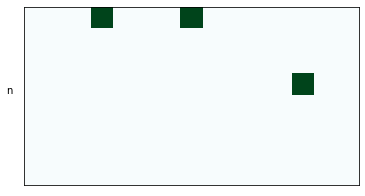

## 问题1

把拓扑图转化成图论的图，用邻接矩阵m表示（黑色为1，白色为0）

若从1点开始，设行向量v=[1,0,0,0,0,0,0,0,0,0,0,0,0,0,0,0,0]（1的16维one-hot向量）表示开始在1位置

则$v\cdot m$即为一步后能达到的地方

右乘m矩阵n次，$v\cdot m^n$即为n步后到达各点的路线数。

如图，以1为起点，走0、1、2、3步后，向量可视化如下（白色为0，颜色越深越大）

记录每个分量第一次出现非0值时为第几步、此时该分量的数值，即可得到1到各点的最短路长多少、有几条。记为$\vec{c_1}$（记录最短路长度）、$\vec{l_1}$（记录最短路数量）

选用不同起点（v选用1~16的16维one-hot向量），将得到的$\vec{c_1}$ ~ $\vec{c_{16}}$堆叠成

$$
C=\left[\begin{matrix}
\vec{c_1}\\
\vec{c_2}\\
\vdots\\
\vec{c_{16}}
\end{matrix}\right]
$$

得到最短路长矩阵C

同理得到最短路条数矩阵L

L阵中最大值在$L_{1,9}$ $L_{9,13}$ $L_{9,1}$ $L_{13,9}$，为4。说明条数最多的节点对为(1,9)、(9,13)、(9,1)、(13,9)，相应的最短路径条数为4

## 问题2

由于两节点间同时进行数据交换，因此只需考虑在$L_{i,j}$中$i<j$的部分，结果乘二即可。需要在每对节点的最短路中，选取一条路径。路径上的每个节点均会产生1单位的负载。现在需要求最合理的选取方案，使得负载的最大值最小。

先使用广度优先搜索(BFS)，列出所有的最短路。结果如下(结果较长，此处只展示了以1为发送节点的路径)

> (1, 2)	[1, 2]
> (1, 3)	[1, 2, 3]
> (1, 4)	[1, 12, 4]
> (1, 5)	[1, 6, 5]	[1, 16, 5]
> (1, 6)	[1, 6]
> (1, 7)	[1, 6, 7]
> (1, 8)	[1, 16, 8]
> (1, 9)	[1, 2, 10, 9]	[1, 6, 14, 9]	[1, 12, 4, 9]	[1, 16, 8, 9]
> (1, 10)	[1, 2, 10]
> (1, 11)	[1, 12, 11]
> (1, 12)	[1, 12]
> (1, 13)	[1, 2, 13]	[1, 12, 13]
> (1, 14)	[1, 6, 14]
> (1, 15)	[1, 16, 15]
> (1, 16)	[1, 16]

共有120对节点，将每对的路径数记为$\vec{mx}$。为了直观展示，将1\*120的行向量变形成8\*15的矩阵。可视化如下

注意到该矩阵比较稀疏（大多数为1），可以通过简单的穷举解决。

穷举得到，负载的最大值最小时，选用方案如下

此时负载最大为6，各节点承载的路由条数如下

> 6 6 6 6 5 6 6 6 5 6 5 6 4 6 5 6

可视化如下（第一个白块表示0，用于对照）。可以看出结果确实较均衡。

由于两节点间同时进行数据交换，结果乘2得

> 12 12 12 12 10 12 12 12 10 12 10 12 8 12 10 12

## 问题3

在第二问的基础上，有两个改动：

1. 不止考虑$i<j$，还要考虑$i>j$
2. 每条路径经过的节点产生的负载，不再为1，而是根据接收和发送节点，从表中得到的权值

加载附件的数据到W矩阵中，用热力图可视化如下

