研习-2 卫星图像上的彩色面积

# 1. 计算相对面积

## 1.1. 数据获取

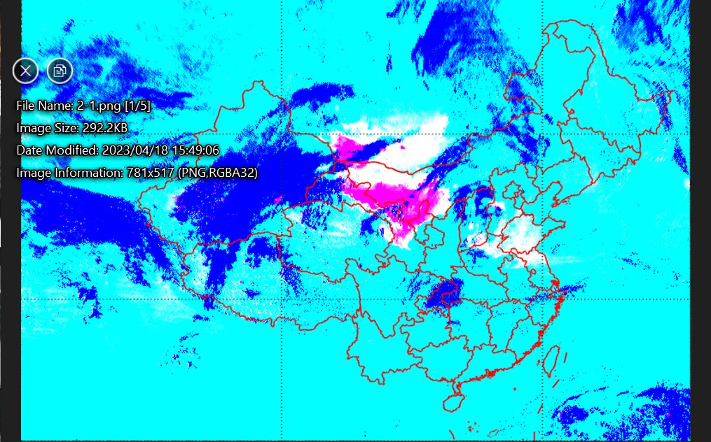

读取图像属性，得到图像大小为781x517(图1)、782x517(图2)。

文件格式为PNG，这是一种无损压缩的位图格式。有RGBA共4个通道，对应红、绿、蓝、透明度。4个通道总共32位，每一个通道是8位(一字节)。这就意味着无需考虑图像编解码算法的细节，编解码不会产生任何变化，不引入参数。直接读入长x宽x通道数的三维数组即可。

## 1.2. 数据清洗

两张图片大小不同。为了方便处理，裁剪边缘部分，使得图片大小统一为780x500。

对于面积计算，只需要两个维度即可。是否可以在红绿蓝3个通道中，通过删除/合并，得到只有两个维度的数据呢？

首先想到的是透明度(A)没用到，可直接忽略。接下来处理3个颜色。

最简单的映射是将3个通道取平均，得到灰度图像。

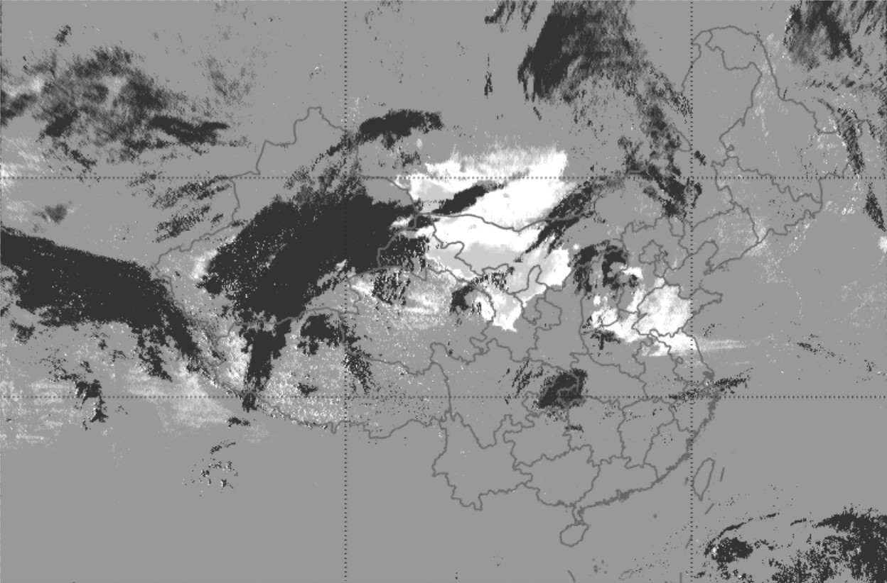

遗憾的是，沙尘区域在灰度图上与外侧区域相似，为了防止影响，否决此方案。

那么能否删除部分通道呢？

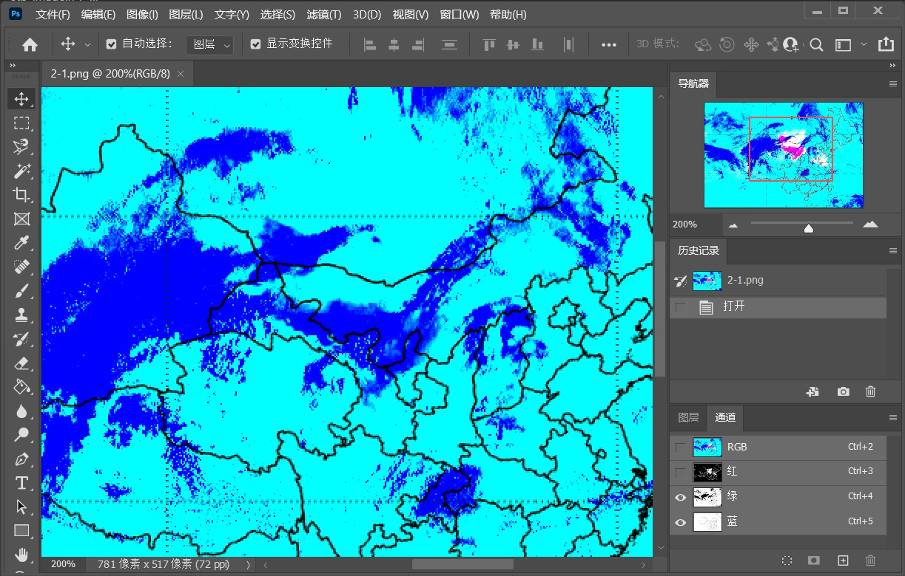 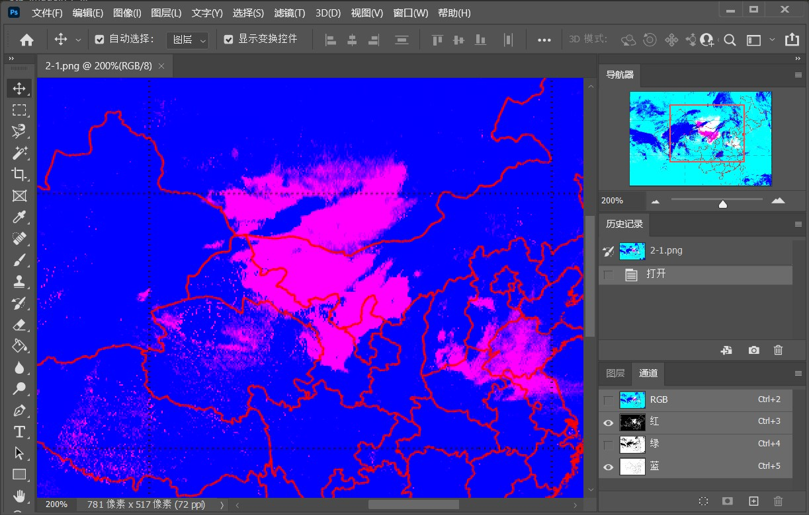 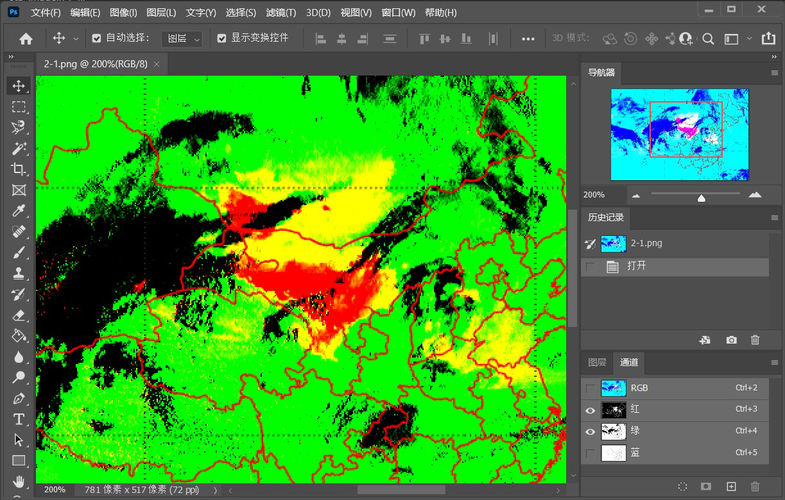

可以看到，删除任意通道会产生歧义，因此我们不再做额外处理。

这样，我们得到大小相同，3通道的图像，每个像素点对应一个3维向量。

## 1.3. 确定沙尘区域

图中，沙尘区域用洋红色表示。事实上，洋红色是绿色的反色，RGB(255,0,255)。

我们把红色和蓝色通道取反，使得目标颜色在CGY颜色空间（Cyan=青, Green=绿, Yellow=黄，青黄取自CMY减色模型）变成CGY(0,0,0)，这样，每个像素对应的颜色向量越小（越黑）就越接近洋红色。

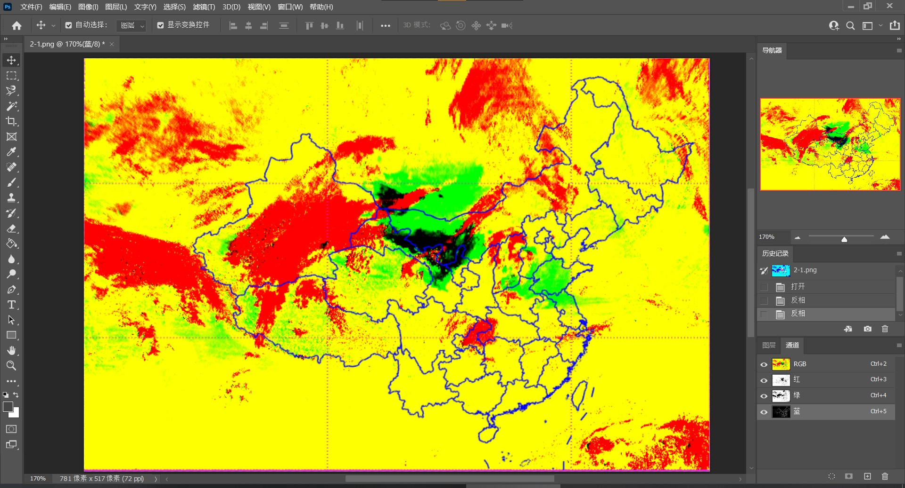

图中可以看出，黑色部分确实对应原图的沙尘区域。

那么怎样判断一个像素“黑不黑”，有多黑呢？或者说，颜色向量有多长呢？

数学上，衡量向量大小的工具是范数。p阶范数的公式定义为
$$
\Vert\vec x\Vert_p=\sqrt[p]{\sum^n_{i=1}|x_i|^p}
$$
取颜色向量的一阶范数（曼哈顿长度），也就是各分量绝对值之和。事实上，归一化之后的一阶范数，就是平均值（灰度值）。

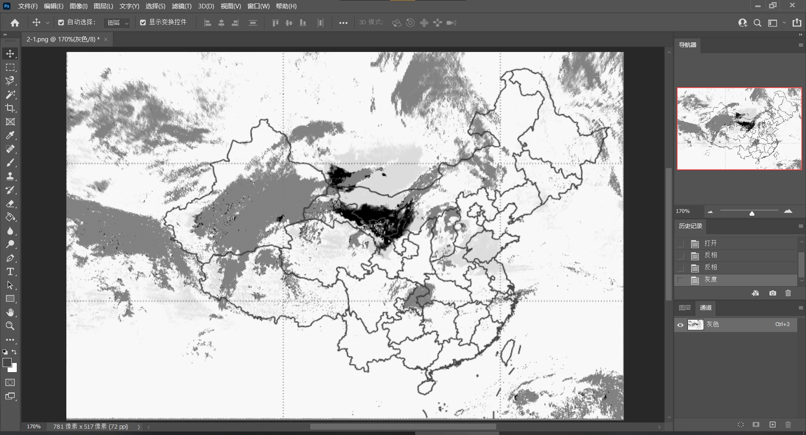

设定合理的阈值，将灰度值小于一定范围(观察直方图，在40的位置有第二个峰，因此选择20可以尽可能包含原图的洋红色区域，同时避免假阳性)的像素点认定为沙尘区域。

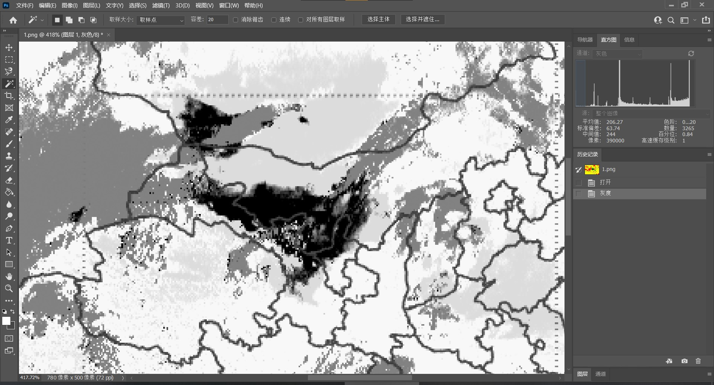

## 1.4. 计数

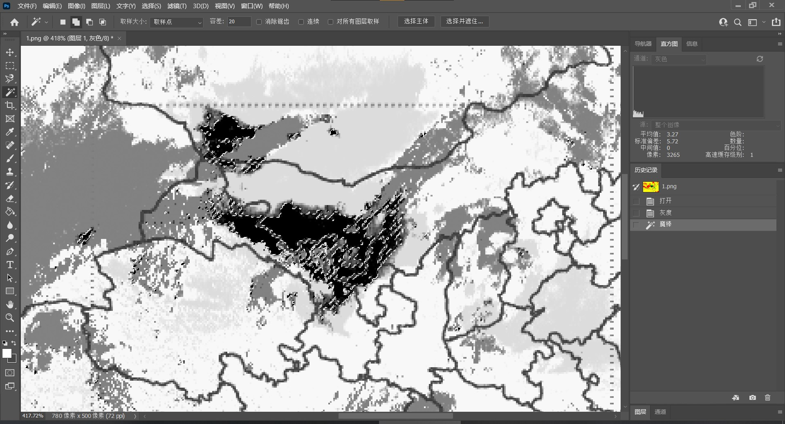

数出图中黑色像素点的个数（3265/390000），这就是面积。

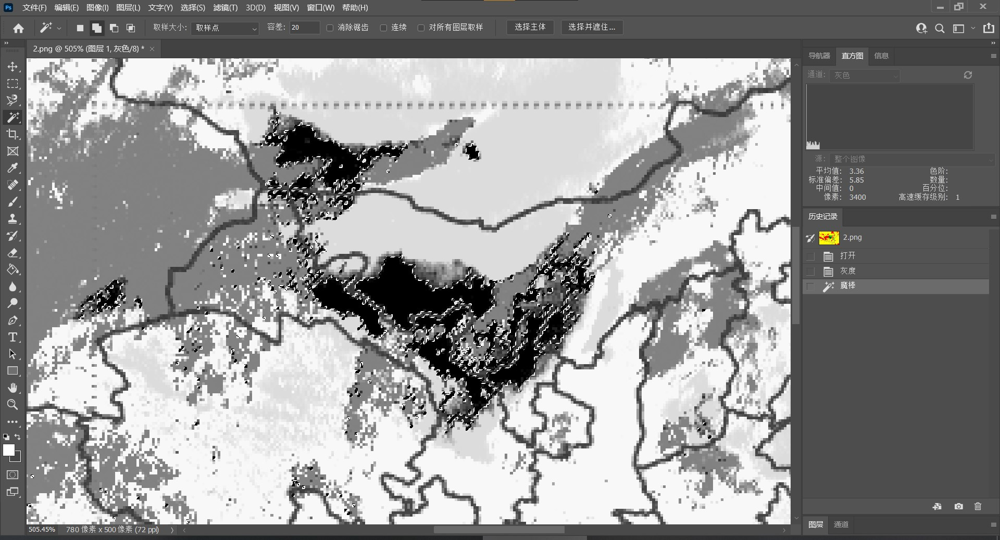

对图2做同样的处理，得到结果（3400/390000）。

因此，我们得出结论，图1到图2，沙尘面积变化倍率为$\frac{3400}{3265}$，增长了$(\frac{3400}{3265}-1)*100\%\approx4.13\%$

## 1.5. 结果分析

我们通过简单的数字图像处理，迅速求得图中与目标颜色相近的像素数量，以此得到了相对面积。高效完成了任务。

---

但是，真实世界是复杂的。上文的方法，隐含了许多假设、简化。简化势必会产生误差。适当简化可以降低难度，完成不可解到可解的转化；过度简化则会导致误差大于可接受的范围。

首先是，上文在比较沙尘面积时，直接对像素点数做了除法。这里只用了相对大小，但此方法无法得到绝对大小，因为没有确定图中像素点和现实地点的映射关系。这需要结合图中的经纬线信息来补充。

此外，把像素点认定为单位面积，也是有问题的。地球不是平的，把球面的地表映射到平面的图形，不是一件简单的事情。这需要结合投影的知识分析。

上文中假设了一个性质：图上任意像素面积相等，左上角还是右下角的像素，对应真实面积没有区别。这是等积性假设。

以上的化简，对于小范围、大比例尺的地图，是成立的。毕竟在生活中，我们观察周边景象时，无需考虑地球曲率。直接计算误差极小。但原图范围较大，包含我国整个陆地领土，因此会产生较大误差。

## 1.6. 地图的数学要素

重新审视原图

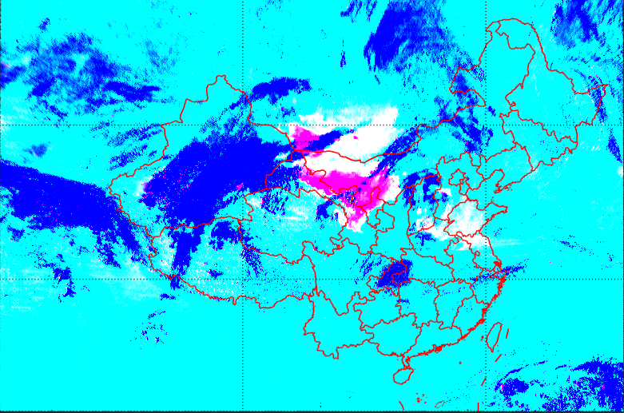

图中的经纬线为直线，说明采用了圆柱投影。常见的方法是是等距圆柱投影和墨卡托投影。

**等距圆柱投影**，直接将经纬度线性映射到X-Y坐标系，经纬线之间等距。

**墨卡托投影**，将地球近似为正球体，球体中心有个发亮的光点，光点将球面上的每个点都投影到正切赤道的圆柱内表面上，将圆柱体内表面展开得到世界地图。

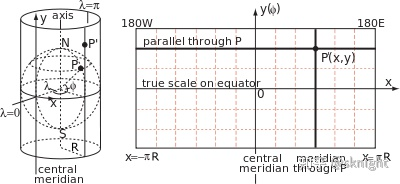

具体是哪个，只给了两根纬线难以判断。等距圆柱投影作为最简单和最古老的地图投影之一，有将近两千年历史。**线性映射**较为方便，并且**没有证据表明**此图不是等距圆柱投影。因此，本报告中把地图当作等距圆柱投影处理。

图中有4个经纬线交点。对照在线地图肉眼观察，左下角接近拉萨(91°E, 29°N)，右下角接近杭州(120°E, 30°N)，左上角接近铁路喀木斯特站(89°E, 45°N)。显然，图中4条虚线对应30°N、45°N、90°E、120°E。

# 2. 计算绝对面积

保留等积性假设，首先设法算出绝对面积

## 2.1. 点的映射

首先要把地图中的点映射到现实中的点。

分析地图的时数学要素时，我们已假定地图采用等距圆柱投影。经纬度通过线性变换得到图中的坐标。

前面已经得到4个经纬线交点对应的经纬度。选取左上、右上、左下作为参照点，将X-Y坐标系线性逆变换还原成经纬度。根据几何推导可以得到每个像素对应的面积。（裁剪时已将两张图的经纬线交点对齐）

|交点|X-Y|经纬度|
| - | - | - |
|左上|(303,147)|(90°E, 45°N)|
|右上|(608,147)|(120°E, 45°N)|
|左下|(303,340)|(90°E, 30°N)|

通过简单的线性回归，可得变换矩阵

$$
\begin{bmatrix}
	10.17&0&-612\\
	0&-12.87&726\\
	0&0&1\\
\end{bmatrix}
\begin{bmatrix}
	E\\
	N\\
	1\\
\end{bmatrix}=
\begin{bmatrix}
	X\\
	Y\\
	1\\
\end{bmatrix}
$$

矩阵求逆，得到逆变换

$$
\begin{bmatrix}
	0.0984&0&60.20\\
	0&-0.0777&56.42\\
	0&0&1\\
\end{bmatrix}
\begin{bmatrix}
	X\\
	Y\\
	1\\
\end{bmatrix}=
\begin{bmatrix}
	E\\
	N\\
	1\\
\end{bmatrix}
$$

## 2.2. 像素点的真实面积

在天地图中，以(90°E, 45°N)、(120°E, 45°N)、(90°E, 30°N)三点为顶点做矩形。量出长、宽

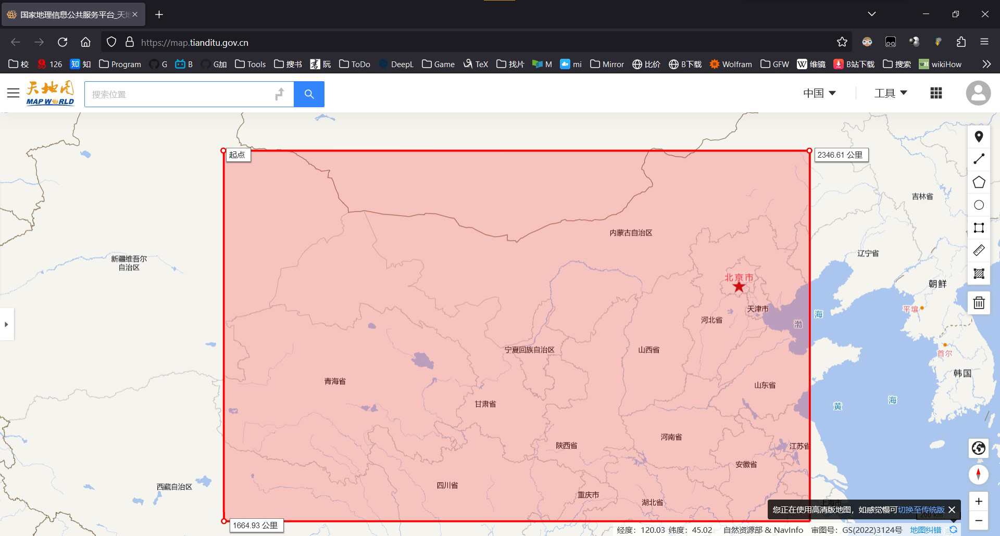

总面积为$2346.6km*1664.9km=3.907*10^6\ km^2$

像素数为$305*193$

单个像素的真实面积为$\frac{3.907*10^6}{305*193}=66.3\ km^2$

## 2.3. 结果

按此前得到的像素数(3265、3400)，得到结果
图1沙尘面积$2.17*10^5\ km^2$
图2沙尘面积$2.25*10^5\ km^2$

# 3. 等积性失效

## 3.1. 推导放大率

等距圆柱投影的等积性会在高纬度下失效。
一个常见的例子是，面积较小的格陵兰岛，在等距圆柱投影下显得比整个南美洲还大。此外，两极点会被拉长成一整行。
以下是比例较为合理的埃托夫投影与等距圆柱投影的世界地图对照

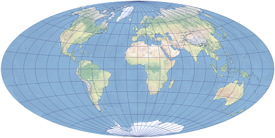
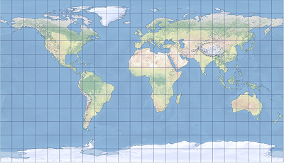

要定量的描述这一畸变，我们要用几何方法推导出微元面积对图上面积的导数，也就是放大率k。

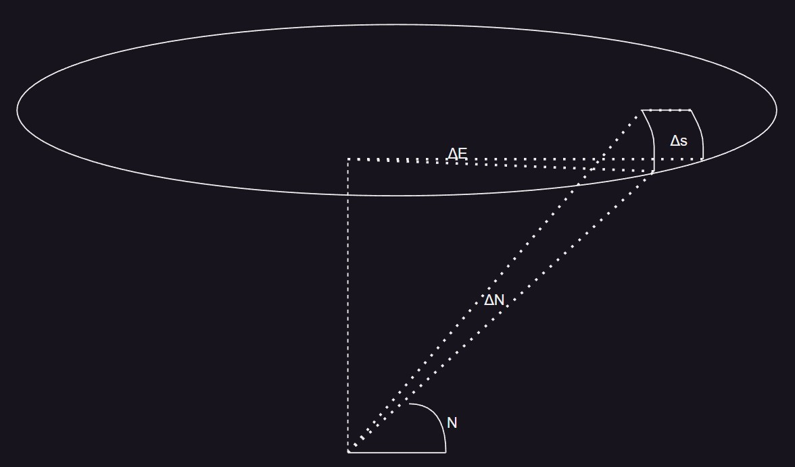

设地球为半径R的球体。几何分析得到，对于每一微元，有

$$
\Delta s=\frac{\pi R}{180}\Delta N\cdot\frac{\pi R\cos N}{180}\Delta E
$$

其中，$\Delta N\cdot\Delta E=\Delta S$（图上面积）

放大率为$k_1=\frac{\Delta s}{\Delta S}=\frac{\pi^2R^2\cos N}{32400}$

代入地球半径$6400km,\pi=3.14159$，得到$k_1=12477\cos N\ km^2$

这是N的一元函数。说明放大率取决于纬度。纬度越大，单位图上面积对应的真实面积越小。

前文中我们算出了X-Y坐标到经纬度的逆变换
$\begin{bmatrix}
	0.0984&0&60.20\\
	0&-0.0777&56.42\\
	0&0&1\\
\end{bmatrix}
\begin{bmatrix}
	X\\
	Y\\
	1\\
\end{bmatrix}=
\begin{bmatrix}
	E\\
	N\\
	1\\
\end{bmatrix}
$

从中可以得出经纬度对坐标的导数：
$\frac{dE}{dX}=0.0984$、
$\frac{dN}{dY}=-0.0777$

从中得到经纬度对X-Y坐标的放大率$k_2=0.0984*0.777=7.64*10^{-3}$

总的放大率为$k=k_1\cdot k_2=95.4\cos N\ km^2$

也就是说，每个像素将对应$95.4\cos(-0.0777Y+56.42)km^2$的面积。我们可以对原图中每个洋红色像素计算放大率，并累加。

## 3.2. 编程求解

此处无法再继续使用图形界面工具photoshop进行运算。选用python的matplotlib库进行进一步处理。

```python
import numpy as np
import matplotlib.pyplot as plt
```

上文中使用photoshop做的部分图像处理是必要的，无需重复工作，直接从转化到CGY颜色空间的步骤继续。
读入图片并显示

```python
f1=plt.imread('1.png')[:,:,:3]
f2=plt.imread('2.png')[:,:,:3]
print(f1.shape)
plt.figure(figsize=(8,4))
plt.subplots_adjust(wspace=0.05)
ax1=plt.subplot(1,2,1)
ax1.imshow(f1)
ax1.axis('off')
ax1.set_title('1')
ax2=plt.subplot(1,2,2)
ax2.imshow(f2)
ax2.axis('off')
ax2.set_title('2')
plt.show()
```

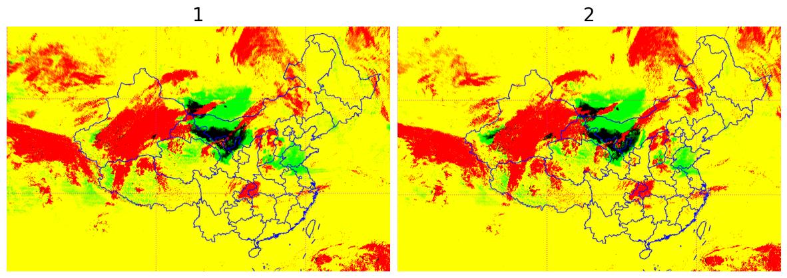

此前为了计算方便，用灰度图表示了一阶范数。其实，衡量向量长度时更多的是使用二阶范数（欧几里得距离）。再使用对数函数，增强暗部的区分度。三者结果显示如下（为了醒目对比，仅显示中央的沙尘区域附近，结果已做归一化）。

```python
l1=f1[:,:,0]+f1[:,:,1]+f1[:,:,2]
l2=np.sqrt(f1[:,:,0]**2+f1[:,:,1]**2+f1[:,:,2]**2)
ll=np.log10(l2+1)

plt.figure(figsize=(15,5))
plt.subplots_adjust(wspace=0.02)
ax1=plt.subplot(1,3,1)
ax1.imshow(l1[150:300,330:500],cmap='gray')
ax1.axis('off')
ax1.set_title('L1',fontsize=25)
ax2=plt.subplot(1,3,2)
ax2.imshow(l2[150:300,330:500],cmap='gray')
ax2.axis('off')
ax2.set_title('L2',fontsize=25)
ax3=plt.subplot(1,3,3)
ax3.imshow(ll[150:300,330:500],cmap='gray')
ax3.axis('off')
ax3.set_title('log',fontsize=25)
plt.show()
```
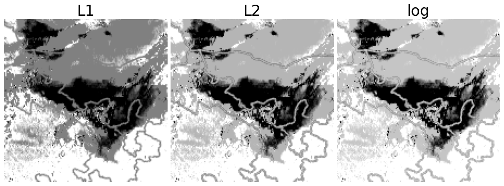

可以看出，二阶范数比均值更有区分度。再加上对数的区别已经不大，因此直接选用二阶范数即可。
接下来是选取合适的阈值，确定沙尘区域。

```python
plt.figure(figsize=(16,16))
plt.subplots_adjust(wspace=0.02, hspace=0)
ax1=plt.subplot(2,2,1)
ax1.imshow((g1>0.4)[150:300,330:500],cmap='gray')
ax1.axis('off')
ax1.set_title('0.4',fontsize=25)

ax2=plt.subplot(2,2,2)
ax2.imshow((g1>0.5)[150:300,330:500],cmap='gray')
ax2.axis('off')
ax2.set_title('0.5',fontsize=25)

ax3=plt.subplot(2,2,3)
ax3.imshow((g1>0.6)[150:300,330:500],cmap='gray')
ax3.axis('off')
ax3.set_title('0.6',fontsize=25)

ax6=plt.subplot(2,2,4)
ax6.imshow(f1[150:300,330:500],cmap='gray')
ax6.axis('off')
ax6.set_title('original',fontsize=25)
plt.show()
```

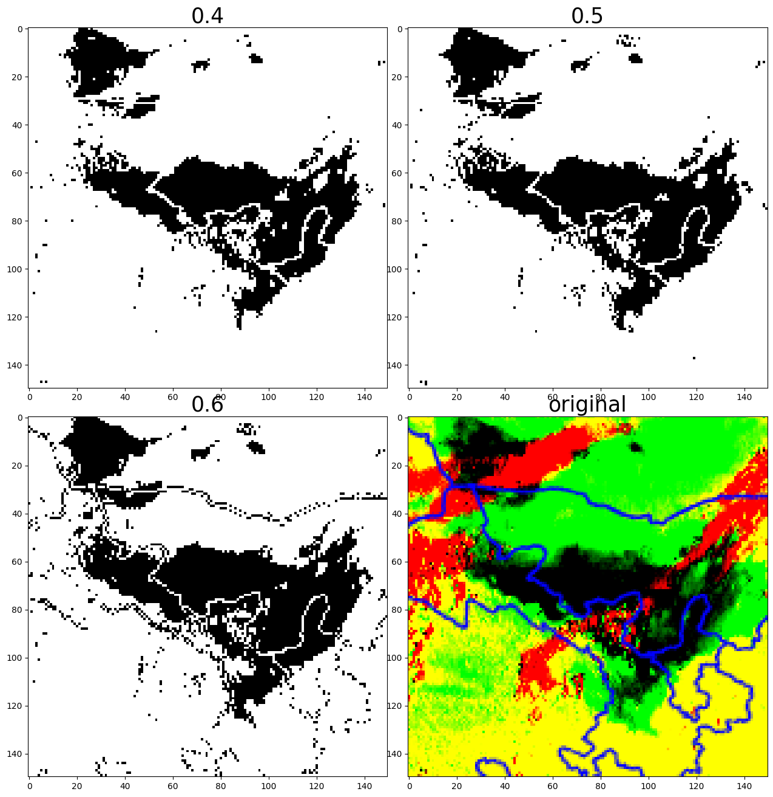

将阈值逐渐放大，可以看到在0.6时产生了假阳性。因此选用0.5作为阈值。

先前我们对于每一个像素，要么取要么不取。而观察原图，可以发现不完全的洋红色。这些区域可能是沙尘浓度不强，或是图像来源还是经过了有损压缩导致的边缘模糊。经过范数、阈值的处理后，可以定量的描述这种相似度。将相似度通过简单的线性变换转化为权重。

规定权重的取值范围是[0,1]；原图上越接近洋红色，变换后就越接近1；取阈值0.5作为新的0。最终得到的权重如下($n_{xy}$指x列y行处像素颜色向量归一化的二阶范数，左上角的像素x=y=0)：

$$
w_{xy}=\begin{cases}
	-2n_{xy}+1&,n_{xy}<0.5\\
	0&,n_{xy}\geq0.5
\end{cases}
$$

乘上该像素对应的真实大小，我们可以得到考虑了不完全洋红色像素的修正公式：

$$
s=\sum_{x=0}^{779}\sum_{y=0}^{499}
w_{xy}\cdot k(x,y)
$$

经过3.1节的推导，我们已经知道，放大率k是关于y的一元函数。因此可以简便一些运算

$$
s=\sum_{y=0}^{499}(\sum_{x=0}^{779}
w_{xy})954\cos(-0.0777y+56.42)
$$

编程求和，得到结果

```python
a=np.matrix(np.cos(np.deg2rad(-0.0777*np.arange(500)+56.42))).T
b=np.matrix(95.4*np.ones((1,780)))
k=a.dot(b)

w1=2*((1-g1)*(g1<0.5)-0.5*(g1<0.5))
ans1=np.multiply(w1,k)

w2=2*((1-g2)*(g2<0.5)-0.5*(g2<0.5))
ans2=np.multiply(w2,k)

plt.figure(figsize=(10,10))
plt.subplots_adjust(wspace=0.02, hspace=0.08)
ax1=plt.subplot(2,2,1)
ax1.imshow(g1[150:300,350:500],cmap='gray')
ax1.axis('off')
ax1.set_title('L2-norm',fontsize=16)

ax2=plt.subplot(2,2,2)
ax2.imshow(w1[150:300,350:500],cmap='gray')
ax2.axis('off')
ax2.set_title('w(x,y)',fontsize=16)

ax3=plt.subplot(2,2,3)
ax3.imshow(k[150:300,350:500],cmap='gray')
ax3.axis('off')
ax3.set_title('k(x,y)',fontsize=16)

ax4=plt.subplot(2,2,4)
ax4.imshow(ans1[150:300,350:500],cmap='gray')
ax4.axis('off')
ax4.set_title('result',fontsize=16)
plt.show()
print(f"图1：{ans1.sum():.2E} km^2")
print(f"图2：{ans2.sum():.2E} km^2")
```

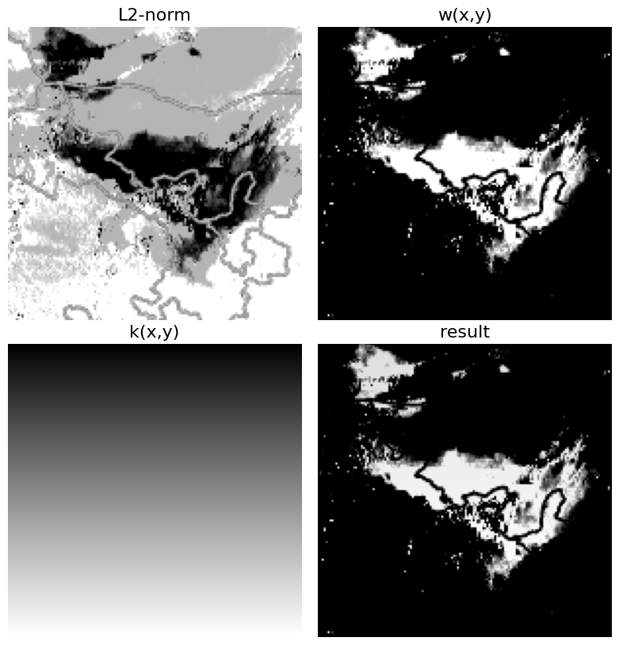

> 图1：2.69E+05 km^2
> 图2：2.81E+05 km^2

最终得到图1沙尘面积$2.69*10^5\ km^2$
图2沙尘面积$2.81*10^5\ km^2$
增长了$(\frac{2.81}{2.69}-1)*100\%=4.46\%$