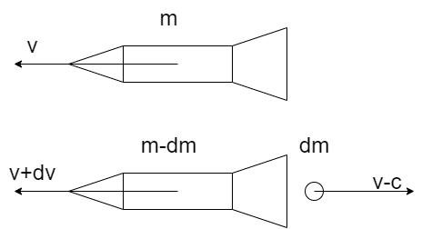
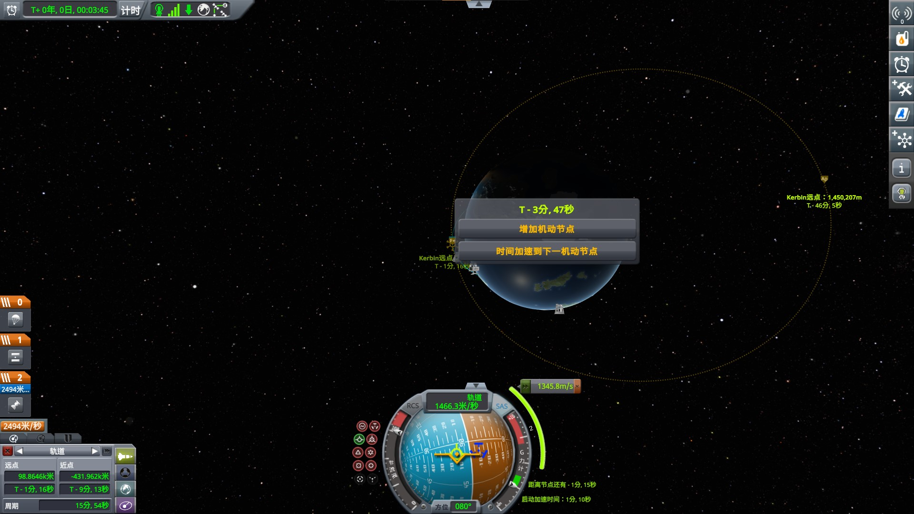
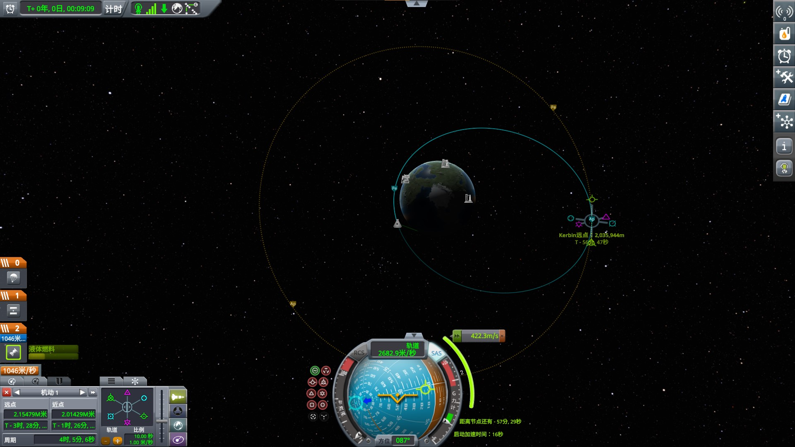
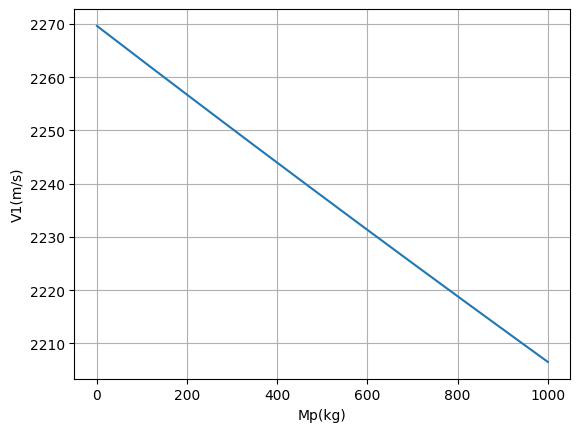
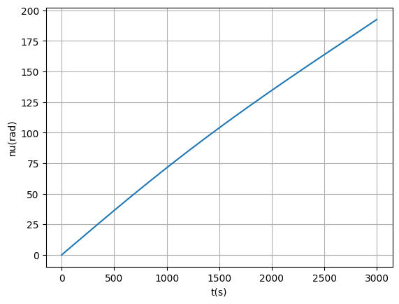
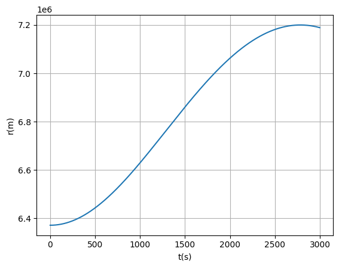
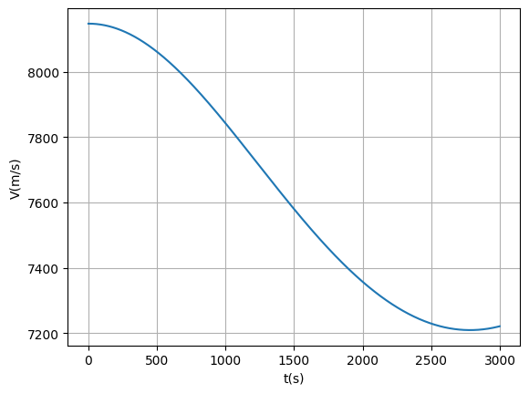
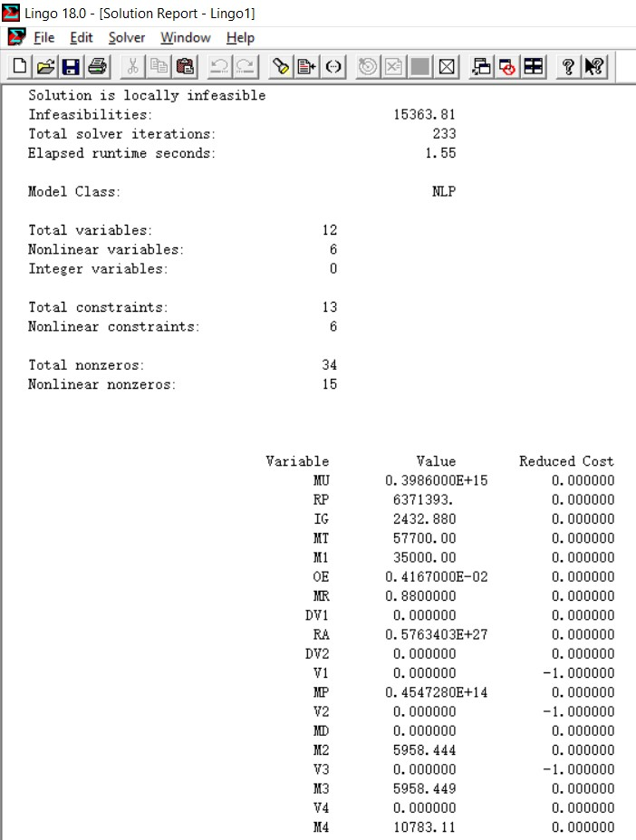
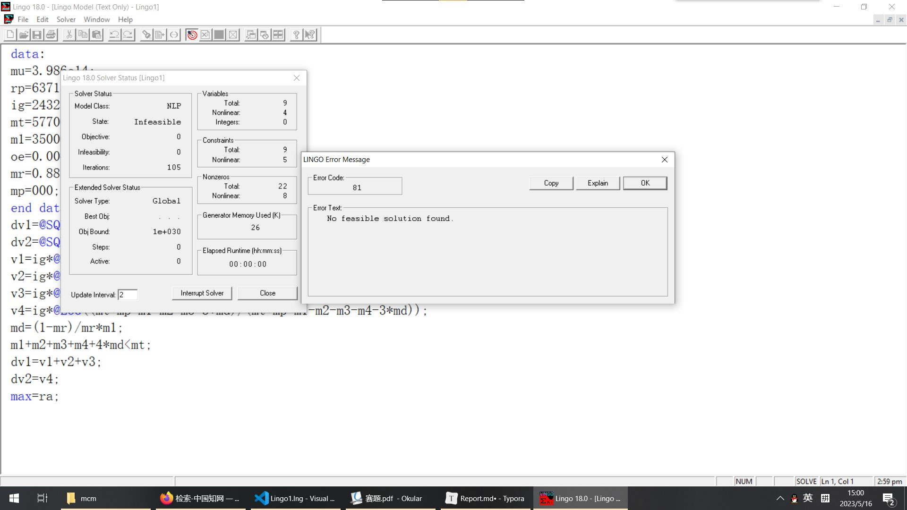

# 对运载火箭运力的研究——以长征十一号为例

## 摘要

长征十一号是长征系列中唯一的纯固体火箭，对我国航天产业的完善有重要意义。本文以其为切入点，对运载火箭进行了动力学建模，研究了运载火箭的运力。

对于第一问，从动量守恒定理出发，推导出火箭方程，代入常量后得到分离时的瞬时速度$V_1=4233\ln\frac{57700+M_p}{22700+M_p}$。当载荷为350kg时结果为2247m/s；载荷为700kg时结果为2247m/s。

对于第二问，通过机械能守恒、角动量守恒、牛顿第二定律，列出二阶常微分方程并求解，最后用数值积分的方法求出了完整的速度-时间关系。变轨前后关键速度如下$\begin{aligned}
V_p&=8147\quad m/s\\
V_a&=7210\quad m/s\\
V_d&=7440\quad m/s
\end{aligned}$

对于第三问，通过列出约束方程组，把问题转化为自变量为$M_2$和$M_3$，参数为$M_p$，最大化目标变量为$R_a$的两变量非线性最优化问题。用Lingo求解，给出了二、三、四级装药量分别为5.96t、5.96t、10.78t时最优。

对于第四问，在上一问的基础上，把把发动机装药质量比做为参数，重复操作。但解这一步时，Lingo给出了没有可行域的报错。可能是我对题意的理解有出入，采用了错误的数据导致的。

### 关键词

动量守恒 火箭方程 常微分方程 数值积分 最优化 仿真

## 问题重述

长征十一号是中航科技集团研制的四级固体运载火箭，是长征系列中唯一的纯固体火箭。具有发射周期短，发射场设施保障要求低的特点，特别适合小型卫星、星座的快速组网发射，对我国航天产业的完善有重要意义。对它的研究有助于我国航天科普事业，拓宽视野，甚至为同学们今后参与相关行业的工作提供初步的知识。

航天任务是一个复杂的系统问题，主要可以分成航天器（载荷）、轨道、任务操控系统和运载工具四方面的问题。本题主要围绕运载工具展开，兼有部分简单的轨道问题。


对于第一问，我们需要获得一二级分离时火箭的瞬时速度，也就是第一级火箭能产生的速度变化（$\Delta V$）。

对于第二问，我们需要考虑运载火箭分级问题，在第一问的基础上，从一个阶段变成四个阶段，获得星箭分离时的轨道高度及瞬时速度。

对于第三问，我们要考虑载荷的重量，并得到载荷重量与轨道高度的关系。

对于第四问，我们要得到不同发动机装药质量比下的火箭运载能力（轨道高度与载荷重量）。

## 问题分析

运载火箭的任务，是把载荷送上目标轨道。因此射击运载火箭时，我们需要按以下步骤来考虑问题：

1. 首先确定目标轨道，用轨道根数（半长轴，偏心率，轨道倾角，升交点赤经，近地点幅角，和真近点角）的方式定量描述轨道。
2. 根据这个轨道设置一系列空间机动（变轨），算出每次变轨需要的速度变化（$\Delta V$）。
3. 计算出每次变轨时，提供相应$\Delta V$所需要的装药量。

固体燃料火箭结构简单，但缺点是不可控制流量、不可重点火。长征十一号是四级火箭，所以我们最多只能进行四次变轨。

### 第一问

基于动量守恒定理，列出动力学方程并积分，得到$\Delta V$。在这一问我们可以得出$\Delta V$与消耗燃料（$\Delta m$）之间的关系。

这一问不需要考虑轨道，在一维空间计算即可。

### 第二问

太阳同步轨道（SSO）的轨道倾角为$98^\circ$左右的逆行轨道，与自转方向相反。因此对于本小问，最省燃料的开始是在北纬$82^\circ$的地方向西发射。

设计两次变轨。第一次是在北纬$82^\circ$的地方向西发射，使轨道倾角满足条件，升交点赤经为$90^\circ$，远地点与目标轨道相切的转移轨道；第二次是在远地点沿切向加速，抬高近地点获得正圆轨道。

发动机装药不是越多越好，不可以“头重脚轻”。比如极端情况下，二三四几级的重量过大，会导致第一级根本无法推动离地。

另外前面提到，固体燃料火箭**不可控制流量、不可重点火**，因此每一级火箭只能属于一个变轨阶段。

在考虑上述限制的情况下，我们需要合理安排每一级的装药量，做一个两个变量的最优化问题（第一级燃料质量和总质量题目已给定，因此我们只需要确定第二、第三级燃料质量）。

### 第三问

长征十一号可以进行海上发射，也就是说，可以从任意纬度发射。为了获取最大的初始线速度，以赤道作为起点。

设计两次变轨。第一次是在赤道向东发射，获得近地点高度为地球半径，远地点与目标轨道相切的椭圆轨道；第二次是在远地点沿切向加速，抬高近地点获得正圆轨道。

### 第四问

把发动机装药质量比做为参数，重复第三问的工作即可。

## 模型假设

1. 火箭可以快速飞出大气层，忽略大气阻力。
2. 发动机喷出的工质全部朝后喷出，有效排气速度固定，因此比冲固定。
3. 地球形状接近正球形。为了简便计算，假设地球就是正球形，目标轨道是正圆形。
4. 火箭姿态（朝向，和围绕自身转动轴的角速度）由RCS（反应控制系统）、动量轮负责控制，不消耗运载火箭的燃料，可以在瞬时完成。
5. 火箭推力远大于大气阻力，因此忽略大气阻力。
6. 每次变轨均使用霍曼转移，即变轨前后轨道在同一平面内（共面），$\Delta V$与当前速度矢量共线（共拱点轨道），速度改变瞬间产生（脉冲点火），在远地点变轨（点火时真近点角为$180^\circ$）。
7. 由于我国航天计划的保密性，对于长征十一号只公开了第一级的基本数据。我们假设四级发动机均相同，只是装药量有区别。
8. 对于第二问，我们得到任意一条太阳同步轨道即可，无需考虑升交点赤经。
9. 对于第三、第四问，均从赤道发射，目标轨道的轨道倾角为零。

由以上假设，最终轨道的轨道根数中，轨道倾角、升交点赤经、近地点幅角、和真近点角这四个属性，要么确定不变，要么任意，因此无需考虑。

## 符号说明

### 符号表

| 符号         | 单位      | 意义                            | 符号         | 单位       | 意义                            |
| ------------ | --------- | ------------------------------- | ------------ | ---------- | ------------------------------- |
| $M_d$        | kg        | 每级火箭的死重(dead weight)     | $M_p$        | kg         | 载荷质量(payload)               |
| $M_1$        | kg        | 第一级火箭的燃料量              | $M_2$        | kg         | 第二级火箭的燃料量              |
| $M_3$        | kg        | 第三级火箭的燃料量              | $M_4$        | kg         | 第四级火箭的燃料量              |
| $c$          | m/s       | 燃料有效速度                    | $I_{sp}$     | s          | 比冲                            |
| $M_t$        | kg        | 火箭总重量(total)               | $\omega_e$   | $^\circ/s$ | 地球自转角速度                  |
| $M_0$        | kg        | 发射前重量                      | $M$          | kg         | 发射后重量                      |
| $V_0$        | m/s       | 发射前的线速度（相对地心）      | $V_1$        | m/s        | 第一级产生的$\Delta V$          |
| $V_2$        | m/s       | 第二级产生的$\Delta V$          | $V_3$        | m/s        | 第三级产生的$\Delta V$          |
| $V_4$        | m/s       | 第四级产生的$\Delta V$          | $V_d$        | m/s        | 目标轨道的环绕速度(destination) |
| $V_p$        | m/s       | 转移轨道近地点的速度(periapsis) | $V_a$        | m/s        | 转移轨道远地点的速度(apoapsis)  |
| $R_p$        | m         | 转移轨道近地点的高度            | $R_a$        | m          | 转移轨道远地点的高度            |
| $\mu_e$      | $m^3/s^2$ | 地球引力常量                    | $\Delta V_1$ | m/s        | 第一次变轨所需的$\Delta V$      |
| $\Delta V_2$ | m/s       | 第二次变轨所需的$\Delta V$      | $MR$         | 无量纲     | 装药质量比(mass ratio)          |

### 常量表

| 常量       | 数值            | 单位       | 常量    | 数值                 | 单位      |
| ---------- | --------------- | ---------- | ------- | -------------------- | --------- |
| $I_{sp}$   | 248             | s          | $g_0$   | 9.81                 | $m/s^2$   |
| $M_t$      | 57700           | kg         | $M_1$   | 35000                | kg        |
| $\omega_e$ | $4.167×10^{-3}$ | $^\circ/s$ | $R_p$   | 6371393              | m         |
| $R_a$(SSO) | 7200000         | m          | $\mu_e$ | $3.986\times10^{14}$ | $m^3/s^2$ |


## 模型建立

### 第一问

#### 动量守恒



如图，一艘向左以$v$速度行驶，当前质量为$m$的火箭，在一个时间微元内，向右喷出了质量为$dm$，相对速度为$c$的燃料（工质）。在该系统不受外力时：

由动量守恒定律可得：$mv=(v+dv)(m-dm)-(v-c)dm$

忽略高阶无穷小，整理得：$dv=-\frac{c\cdot dm}{m}\qquad(1.1)$

#### 齐奥尔科夫斯基火箭方程

设某一阶段开始时火箭速度为$V_0$，质量为$M_0$；结束时火箭速度为$V$，质量为$M$。对(1.1)式两边积分得：
$$
V-V_0=c\ln\frac{M_0}{M}\qquad(1.2)
$$
这就是著名的齐奥尔科夫斯基火箭方程(简称火箭方程)。

#### 比冲

使用燃料，是为了产生动量。我们认为消耗相同的燃料，产生的动量越多，说明火箭的性能越好。定量衡量这一性能的工具，就是比冲。定义比冲 （$I_{sp}$）为：

$$
I_{sp}=|\frac{m\cdot dv}{g_0\cdot dm}|\qquad
$$

其中，$g_0$是重力加速度常数，$g_0=9.81m/s^2$。引入该常量，可以使量纲简洁，也使得比冲表示单位时间内消耗单位重量的燃料能在地表举起多少千克的物体。

代入(1.1)式，可得：
$$
I_{sp}=\frac c{g_0}\qquad(1.3)
$$

也就是说，比冲只取决于喷出燃料的相对速度。

代入(1.2)式，可得$\Delta V=I_{sp}g_0\ln\frac{M_0}{M}\qquad(1.4)$

### 第二问

#### 霍曼转移轨道

霍曼转移，是共面变轨中，最节约燃料的方式，在模拟器中展示如下：



第一次变轨：升空后，沿切线方向加速，抬高远地点。



第二次变轨是在远地点，切向加速，抬高近地点，最终获得圆轨道。

定量的分析见下图：


如图，(A)表示发射之前，火箭跟随地球自转，有一个线速度。

(B)表示第一次变轨之后的**转移轨道**。

(C)表示第二次变轨之后的**目标轨道**。

我们的任务便是计算图中这几个速度.

#### 动能

牛顿第二定律是：$F=m\frac{dv}{dt}$

两边乘上位移微元dr，得到：$F\cdot dr=mv\cdot dv$

换元，得到$F\cdot dr=d\frac{mv^2}2$

记为左侧$F\cdot dr$外力做功$dW$，右边为动能变化$dE_k$，积分可得动能定理$W=E_k-E_{k0}$

设物体静止时动能为零，则可得动能为$E_k=\frac{mv^2}2$

#### 引力势能

众所周知，万有引力的公式为$F=\frac{GMm}{r^2}$为了简化问题，我们无需知道具体的万有引力常量G和地球质量M，只需乘起来，记作地球引力常量$\mu_e=GM$。

我们记引力能做功的潜力(Potential)为引力势能。设无穷远处为引力势能零点，把小物体放到无穷远处，受中心天体的引力作用下，不断靠近，直到距离为r。在此过程中，中心天体引力对其做的功为$W=\int_{+\infty}^r(-\frac{\mu_em}{x^2}dx)$。对右侧积分得到$W=\frac{\mu_em}{r}$。此过程中不断做正功，是在消耗自己的势能。所以，引力势能的公式为$E_p=-\frac{\mu_em}{r}$。这是一个路径无关的过程，不管航天器走了什么样的路径，在离中心星体物理为r的球面上，引力势能永远是这样的。

#### 比机械能守恒

机械能是指势能+动能。在某一过程中，物体的机械能变化，是其所受的非保守力做功之和。对于航天问题，我们的运载火箭通常只受两个力：作为保守力的引力、作为非保守力的燃料反作用力。$E=E_p+E_k=\frac{mV^2}2-\frac{\mu m}{r}$。

在两次变轨之间，燃料没有推动力，航天器质量也不会变化。则机械能守恒，我们只需要它是守恒的，不关心具体的值是多少，因此可以把m约掉。

定义比机械能为

$$
\epsilon=\frac Em=\frac{V^2}2-\frac\mu r\qquad(2.1)
$$

这玩意儿还是守恒的。

#### 比角动量守恒

比角动量定义为$\vec h=\vec r\times\vec v$

考虑它的投影形式$h=r\cdot v_\tau$

进一步可以化成角速度形式

$$
h=r^2\omega\qquad(2.2)
$$

在只受向心力的情况下，这也是守恒的。

#### 极坐标下的轨道

写出牛顿第二定律的向量形式$\vec F=m\vec a$

仅受引力时式子可以化为$-\frac{\mu m}{r^2}\frac{\vec r}{r}=m{\vec r}^{''}$

这是二阶常微分方程。极坐标下可以解为

$$
r=\frac{k_1}{1+k_2\cos\nu}\qquad(2.3)
$$

其中$\nu$是真近角。

这样，对于轨道上的任意角度，我们可以求得航天器运行到此处时，距离中心天体的距离，进而用引力势能和机械能守恒，求出它在此处的速度。

结合比机械能守恒、比角动量守恒和极坐标轨道公式，我们可以算出比机械能为$\epsilon=-\frac{\mu}{2a}$，其中a为椭圆轨道的半长轴。$2a=R_a+R_p$

#### 求变轨前后的速度

经过上述复杂且跑题的推导，我们得到了比机械能守恒，并得到了一个重要公式$\frac{V^2}2-\frac\mu r=\epsilon=-\frac{\mu}{2a}$

所以转移轨道上任意点处的速度为
$$
\frac{V^2}{2}-\frac{\mu_e}{r}=-\frac{\mu_e}{R_a+R_p}\\
V=\sqrt{2\mu_e(\frac1{r}-\frac1{R_a+R_p})}\qquad(2.4)
$$
对于转移轨道近地点的情况，可以得到
$$
V_p=\sqrt{2\mu_e(\frac1{R_p}-\frac1{R_a+R_p})}\qquad(2.5)
$$
同理可得
$$
\begin{aligned}
V_a&=\sqrt{2\mu_e(\frac1{R_a}-\frac1{R_a+R_p})}\qquad&(2.6)\\
V_d&=\sqrt{\frac{\mu_e}{R_a}}&(2.7)
\end{aligned}
$$

#### 求任意时刻的速度

把(2.5)、(2.6)的值带进(2.3)，用待定系数法可以求得其中的$k_1$、$k_2$

有这几个公式，我们可以得到轨道上任意一点的线速度、距中心星体的距离，再结合角动量守恒可以求得角速度。解一解微分方程，我们就可以得到任意时刻速度与时间的定量关系了。

### 第三问

上一问求得的各阶段所需速度依然成立：
$$
\begin{aligned}
V_p&=\sqrt{2\mu_e(\frac1{R_p}-\frac1{R_a+R_p})}&(3.1)\\
V_a&=\sqrt{2\mu_e(\frac1{R_a}-\frac1{R_a+R_p})}&(3.2)\\
V_d&=\sqrt{\frac{\mu_e}{R_a}}&(3.3)
\end{aligned}
$$
其中,$R_p$是地球半径，$R_a$是能达到的高度。

从赤道附近向东出发，初始限速度为$V_0=\omega_e\cdot R_p\qquad(3.4)$

$$
\begin{aligned}
\Delta V_1&=V_p-V_0\qquad(3.5)\\
\Delta V_2&=V_d-V_a\qquad(3.6)
\end{aligned}
$$

(3.1)~(3.4)代入(3.5)、(3.6)，得
$$
\begin{aligned}
\Delta V_1&=\sqrt{2\mu_e(\frac1{R_p}-\frac1{R_a+R_p})}-\omega_e\cdot R_p&(3.7)\\
\Delta V_2&=\sqrt{\frac{\mu_e}{R_a}}-\sqrt{2\mu_e(\frac1{R_a}-\frac1{R_a+R_p})}&(3.8)
\end{aligned}
$$


回顾之前的公式$\Delta V=I_{sp}g_0\ln\frac{M_0}{M}\qquad(1.4)$

已知$M_1$、$MR$，则死重$M_d=M_1/MR-M1=\frac{1-MR}{MR}M_1\qquad(3.9)$

则
$$
\begin{aligned}
V_1&=I_{sp}g_0\ln\frac{M_t+M_p}{Mt+M_p-M_1}&(3.10)\\
V_2&=I_{sp}g_0\ln\frac{M_t+M_p-M_1-M_d}{M_t+M_p-M_1-M_d-M_2}&(3.11)\\
V_3&=I_{sp}g_0\ln\frac{M_t+M_p-M_1-M_2-2M_d}{M_t+M_p-M_1-M_2-M_3-2M_d}&(3.12)\\
V_4&=I_{sp}g_0\ln\frac{M_t+M_p-M_1-M_2-M_3-3M_d}{M_t+M_p-M_1-M_2-M_3-M_4-3M_d}&(3.13)\\
\end{aligned}
$$
还有总质量的约束条件$M_1+M_2+M_3+M_4+4M_d\leq M_t$

最优情况一定是燃料恰好用完的，因此上市改为等式
$$
M_1+M_2+M_3+M_4+4M_d=M_t\qquad(3.14)
$$


固推燃尽条件（前面已经说明，不管载荷多轻，第一级也无法独立完成第一步变轨）
$$
\begin{cases}
V_1+V_2=\Delta V_1\\
V_3+V_4=\Delta V_2
\end{cases}\qquad (3.15)
$$
或者是
$$
\begin{cases}
V_1+V_2+V_3=\Delta V_1\\
V_4=\Delta V_2
\end{cases}\qquad (3.16)
$$
只需找出，同时满足(3.7)~(3.14)，并满足(3.15)/(3.16)其中之一的，最大的$R_a$即可。

由于现在全是等式，我们可以转化为，自变量为$M_2$和$M_3$，参数为$M_p$，最大化目标变量为$R_a$的两变量非线性最优化问题。

## 模型求解

### 第一问

题干直接给出了$I_{sp}$和$g_0$。而$M_0=M_t+M_p$，$M=M_t+M_p-M_1$

代入常量到(1.4)式，得
$$
V_1=\Delta V=4233\ln\frac{57700+M_p}{22700+M_p}
$$


若载荷350kg，则$V_1=2247m/s$

若载荷700kg，则$V_1=2225m/s$

众所周知，第一宇宙速度是$7900m/s$。而即使是空载，第一级运载火箭也只能产生2270m/s的速度，这点速度不足以入轨。因此，第一级燃尽后，要立刻分离并继续加速。

### 第二问

把已知数据代入到(2.4)、(2.5)、(2.6)式，解得：
$$
\begin{aligned}
V_p&=8147\quad m/s\\
V_a&=7210\quad m/s\\
V_d&=7440\quad m/s
\end{aligned}
$$
把转移轨道近地点、远地点的数据代入(2.3)，得

$$
\begin{cases}
6371393(1+k_2)=k_1\\
7200000(1-k_2)=k_1
\end{cases}
$$

解得
$$
6371393+6371393k_2=7200000-7200000k_2)
$$

$$
\begin{cases}
k_1=6.760\times10^6\quad m\\
k_2=6.106\times10^{-2}
\end{cases}
$$
把近地点的数据代入比角动量$h=r\cdot v_\tau$，得到$h=5.191\times10^{10}\quad m^2/s$

则任意一点的角速度(弧度制)为$\omega=h/r^2=\frac{5.191\times10^{10}*(1+6.106\times10^{-2}\cos\nu)^2}{(6.760\times10^6)^2}\quad s^{-1}=\frac{d\nu}{dt}$

使用远地点数据验证无误。

使用开普勒第三定律$T=2\pi\sqrt{\frac{a^3}\mu}$计算转移轨道的周期。下一步的数值积分需要至少进行半个周期。代入数值求得半周期$\frac T2=2781s$

对$\frac{d\nu}{dt}(\nu)$进行数值积分，得到$\nu(t)$函数。



再把$\nu(t)$函数的结果代入(2.3)得到$r(t)$函数



最后把$r(t)$函数代入(2.4)即可得到$V(t)$函数



### 问题三

把(3.7)~(3.15)塞入`Lingo`尝试



Lingo对结果的把握不高，但依然给出了结果：二、三、四级装药量分别为5.96t、5.96t、10.78t时最优。

### 第四问

在上一问的基础上，把MR的赋值去掉，也作为参数。



但是Lingo直接报错，说没有可行域。

## 评价与推广

在模型假设部分，为了计算的可行性，我忽略了大气阻力。事实上，在火箭发射初期，大气阻力是很重要的影响因素，实际模拟器操作中，气动中心和推力中心的相互关系还是影响很大的。在推导时引入$f=-kv^2$的阻力因子是有必要的。只是能力不足以做出解析解了。

后在问我使用了霍曼转移，这是在航天，尤其是深空探索任务中最常用的获取圆轨道的方法。但是再仔细研究了相关文献，我发现自己陷入的思维定势中，得到了错误的方案。小型固体推进器，因为比冲显著低于常用的液体推进器，弹道更接近洲际导弹，不符合费曼转移的脉冲推进条件。但是，在解题的过程中我也算出了完整的角速度、速度、距离与真近角的函数关系，对于卫星轨道有了更深刻的了解，可以用于追踪天上卫星的实时位置，对航天科普有积极意义。

本地的第四问没有算出结果，第三问的结果可信度也较低。可能是我对题意的理解有出入，采用了错误的数据导致的。

## 参考文献

[1] 程稼夫，中学奥林匹克竞赛物理教程 力学篇，合肥：中国科学技术大学出版社，2013

[2] (美) 塞勃 (Sellers,J.J.) 等，理解航天：航天学入门，北京：清华大学出版社，2007

[3] 夏梦寻Official，常见航天器轨道的简单介绍，https://www.bilibili.com/read/cv458854/，2023.5.16

[4] MrFrost，坎巴拉太空计划新手教程，https://zhuanlan.zhihu.com/p/34642153，2023.5.16

[5] Squad，Kerbal Space Program on Steam，https://store.steampowered.com/app/220200/Kerbal_Space_Program/，2023.5.16

## 附录

### 绘图与数值积分的python代码

```python
# %%
import numpy as np
import matplotlib.pyplot as plt
from math import sqrt,cos

# %%
m=np.linspace(0,1000,1000)
v=2432.88*np.log((m+57700)/(m+22700))
plt.plot(m,v)
plt.grid()
plt.xlabel('Mp(kg)')
plt.ylabel('V1(m/s)')
plt.show()

# %%
u = 3.986 * 10**14
ra = 7200000
rp = 6371393
oe = 4.167 * 10**(-3)
h=sqrt(2*u*(1/rp-1/(rp+ra)))*rp
k2=(ra-rp)/(ra+rp)
k1=ra*(1-k2)

# %%
T=2*np.pi*sqrt(((ra+rp)/2)**3/u)
T/2

# %%
t=0.0
ts=[]
nu=[0]
omega=[]
r=[6371393]
d=1
for i in range(int(3000/d)):
    ts.append(t)
    r.append(k1/(1+k2*cos(nu[-1])))
    o=h/r[-1]**2
    omega.append(o)
    nu.append(nu[-1]+o*d)
    t+=d
nu=np.array(nu[:int(3000/d)])
plt.plot(ts,nu/np.pi*180)
plt.grid()
plt.xlabel('t(s)')
plt.ylabel('nu(rad)')
plt.show()
r=np.array(r[:int(3000/d)])
plt.plot(ts,r)
plt.grid()
plt.xlabel('t(s)')
plt.ylabel('r(m)')
plt.show()
v=np.sqrt(2*u*(1/r-1/(ra+rp)))
plt.plot(ts,v)
plt.grid()
plt.xlabel('t(s)')
plt.ylabel('V(m/s)')
plt.show()
```

### 求解最优化轨道的Lingo代码

```lingo
data:
mu=3.986e14;
rp=6371393;
ig=2432.88;
mt=57700;
m1=35000;
oe=0.004167;
mr=0.88;
mp=000;
end data
dv1=@SQRT(2*mu*(1/rp-1/(ra+rp)))-oe*rp;
dv2=@SQRT(mu/ra)-@SQRT(2*mu*(1/ra-1/(ra+rp)));
v1=ig*@LOG((mt+mp)/(mt+mp-m1));
v2=ig*@LOG((mt+mp-m1-md)/(mt+mp-m1-m2-md));
v3=ig*@LOG((mt+mp-m1-m2-2*md)/(mt+mp-m1-m2-m3-2*md));
v4=ig*@LOG((mt+mp-m1-m2-m3-3*md)/(mt+mp-m1-m2-m3-m4-3*md));
md=(1-mr)/mr*m1;
m1+m2+m3+m4+4*md<mt;
dv1=v1+v2+v3;
dv2=v4;
max=ra;
```

